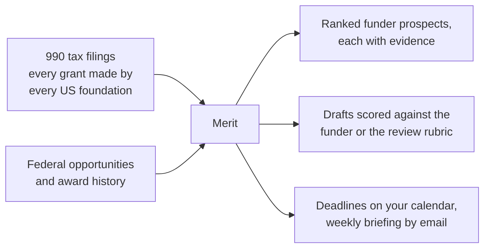
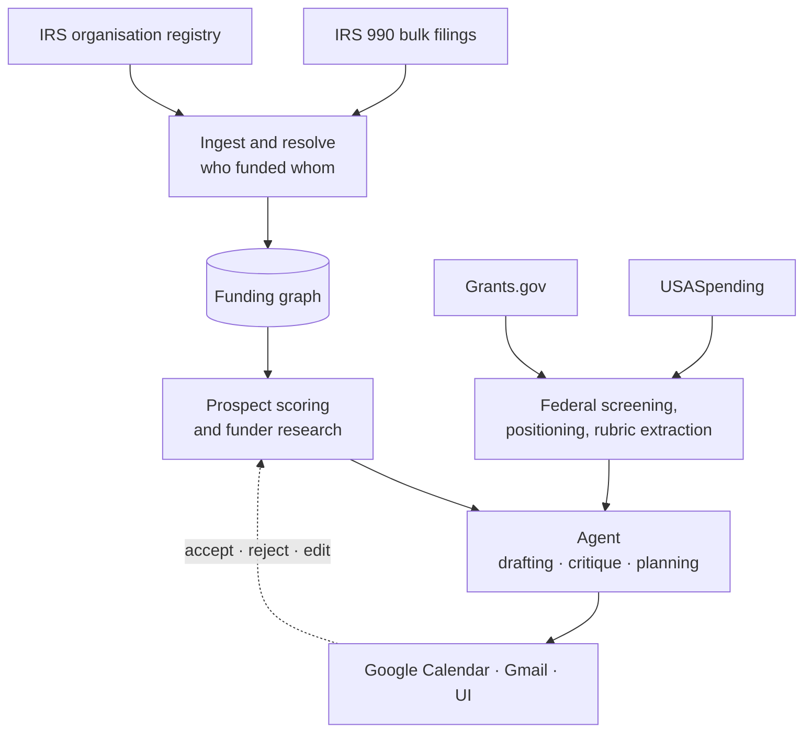

# Merit

### An AI development officer for small nonprofits

**Author:** Nahom
**Date:** 7 August 2026
**Status:** Solution design. Core thesis validated on real data (§4).

---

Merit finds the foundations that would realistically fund a specific small nonprofit, tells the organisation whether each one is worth approaching and what to ask for, drafts the application, and manages the deadlines. It works on a schedule without being asked.

It is built for organisations under about $5M in revenue with zero to one fundraising staff. The work it replaces currently costs $2,000 to $6,000 a month on retainer, or about $98,000 a year in-house.

---

## 1. The problem

A small nonprofit needs money from foundations. Finding out which foundations might give it money is close to impossible for them.

There is no directory of open opportunities, because foundation money is mostly not announced. There is no RFP, no posted deadline, no listing. The information exists, buried in tax filings, but reading it at any useful scale is not something a two-person development office can do.

So they guess. They apply to whatever they hear about, from whoever mentioned it, and most of those applications were never winnable. I saw this at A2SV, a nonprofit I worked at. We had a hired grant finder, and the entire team still got pulled into chasing funding. Engineers stopped engineering to help assemble applications that, in hindsight, we had no realistic chance of winning.

The expensive part is not the fundraiser's salary. It is everyone else's time, spent on the wrong opportunities, because nobody could answer a basic question: **is this funder even reachable for us?**

| What organisations pay today | Price |
|---|---|
| Freelance grant writers | $50 to $150 per hour |
| Ongoing retainer | $2,000 to $6,000 per month |
| In-house grant writer, fully loaded | about $98,000 per year |
| Foundation research software (Candid, Instrumentl) | $179 to $899 per month |

## 2. Where the money actually is

Federal grants are posted and openly competed, and they overwhelmingly go to large institutions. For a $600k community organisation, most of that money was never really available.

Foundation money is different. It sustains small organisations, and it is invisible. But every grant-making organisation in the United States files a tax return that itemises **every grant it made**: recipient, address, purpose, and amount. The IRS publishes these in bulk as structured data, for free.

That corpus is a complete record of who funds whom in American philanthropy. Merit reads it, turns it into a graph of funders and recipients, and answers questions the organisation could not otherwise ask:

* Which foundations fund organisations genuinely like us?
* Would this one actually consider a newcomer, or has it funded the same twelve organisations for six years?
* What is a realistic first ask, rather than the ceiling printed in a brochure?
* Which organisations are our real peers, measured by who funds them rather than by how they describe themselves?

## 3. What Merit does



**Finds funders you would never have found.** Merit builds a peer set from organisations similar to yours by program area, size, and region, then treats every funder of every peer as a candidate. Most of these have never posted an opportunity anywhere.

**Tells you whether to bother.** For each candidate it computes behaviour from the funder's own filing history: what share of its grantees turn over each year, how many first-time grantees it adds, how far from home it gives, what it actually funds, and how long it keeps a grantee. A foundation that has funded the same list for five years is saturated, and applying is close to futile no matter how well the mission matches.

**Sets the ask.** The recommended amount comes from the distribution of that funder's first grants to new grantees, filtered to organisations your size.

**Writes the application, then critiques it.** Federal announcements publish a scoring rubric with explicit point values. Merit extracts it, drafts each section against the sub-criteria that section is scored on, scores its own draft, revises the weakest sections weighted by points available, and reports what it could not fix because it needs a fact only a human has. For foundation prospects, where no rubric exists, it drafts against the language that funder has actually used across its own grant history.

**Works unprompted.** It sweeps federal opportunities daily, watches deadlines, writes milestones to Google Calendar, and emails a weekly briefing. The user does not have to log in for the system to produce value.

**Learns.** Every prospect accepted or rejected, every override, and every edit to a draft is captured and adjusts the model of what this particular organisation should pursue.

## 4. Proof: validated on real data

The thesis is that a national giving graph surfaces real, reachable, regional funders for a genuinely small organisation. That has now been tested rather than assumed.

Three real nonprofits were run against a partial corpus of **148,872 grant records** drawn from the first three monthly IRS bundles, roughly 17% of one year by volume.

| Test organisation | Revenue | Credible funders found | Of which regional |
|---|---|---|---|
| Cape Fear Literacy Council, Wilmington NC | $656k | 16 | 10 |
| Lake County Free Clinic, Painesville OH | about $1.2M | 74 | 37 |
| Boys and Girls Club of Cabarrus County, Concord NC | $4.5M | 57 | 24 |

"Credible" is not a raw count. It requires the funder to have given either to two or more peer organisations, or to one organisation in region, with a median grant above a materiality floor set at 0.5% of the organisation's revenue with a $2,500 minimum. The small family foundations that would be noise for the $4.5M club are excluded from its list, and counted for the literacy council.

The bar set before the test was 15 credible funders for the smallest organisation. It clears that on 17% of one year's data.

**The results are qualitatively right.** The funders surfaced include the Cannon Foundation, Cape Fear Memorial Foundation, Timken Foundation of Canton, and the Pallottine Foundation of Huntington. These are regional family and community foundations with median grants between $25,000 and $100,000. None of them post RFPs. None would appear in a federal opportunity sweep.

**The corpus is much larger than first estimated.** An early figure of about 140,000 grant records per year was extrapolated from a single small bundle and was badly low. Ingestion of the full year is still running. At four bundles it stands at **598,170 grant records**, about 27% of the year by download volume, which projects to roughly **2 million grant records annually**. Coverage is therefore far better than assumed, and the ingestion work is correspondingly more substantial.

## 5. What the user sees

| Surface | Purpose |
|---|---|
| **Prospect list** | Ranked funders. Openness, program affinity, geography, and size fit are shown as four separate bars, never collapsed into one opaque number |
| **Funder report** | Grantee list by year, turnover over time, ask-size distribution, geographic spread, program mix. The "should we bother" view |
| **Peer view** | Organisations that share your funders, and what they receive |
| **Federal board** | Fit score for each open opportunity, with the award history of past winners behind it |
| **Draft studio** | The draft beside the extracted rubric, with per-criterion scores before and after revision, and weak criteria flagged with what the human needs to supply |
| **Ask the graph** | Plain-language questions against the corpus, with the query and the underlying rows shown |
| **Portfolio planner** | A recommended shortlist given how many applications the organisation can realistically submit this quarter, and what is being given up |
| **Review queue** | Uncertain entity matches surfaced for human confirmation |

Every recommendation is inspectable. The grantee rows behind any score can be opened, because a development director has to defend a prospect list to a board, and "the model said so" is not a defence.

## 6. How it works

Two halves. An offline pipeline builds the graph from bulk tax filings. An online agent reasons over it and takes action.



The offline half is the harder engineering. Filings name the funder by tax ID but name the recipient only as a free-text string, so `ST PATRICK CATHOLIC SCHOOL` and `St. Patrick's Catholic School` may be one organisation or two. Until those strings are resolved to real organisations, the graph is unusable. §8 covers how that is done and how its accuracy is measured.

The online half runs three scheduled jobs a day and a set of agent loops described in §9.

---

## How it works in detail

*The sections above describe the product. The rest of this document answers the questions they raise.*

## 7. Data sources

Every source is free and needs no API key, no registration, and no credit card. All were called live on 7 August 2026; the verification log is in the appendix.

| Source | What it provides |
|---|---|
| IRS 990 bulk XML | Itemised grants from private foundations (990-PF Part XV) and grant-making public charities (990 Schedule I) |
| IRS Exempt Organizations registry | Canonical record of every registered US nonprofit: tax ID, name, address, program code, revenue |
| Grants.gov | Federal opportunities, plus the full announcement PDF containing the review rubric |
| USASpending | Federal award history, keyed on the same program number Grants.gov returns |
| ProPublica Nonprofit Explorer | Funder financial trend and capacity |
| Google Calendar, Gmail | Milestones and briefings (OAuth, no billing account) |

Both grant tables matter. Parsing only the private foundation table is the obvious path and misses Form 990 Schedule I entirely, which in a single sample bundle added 875 grant-making organisations and 7,777 grant records. Those are largely community foundations and federated funders, which are among the most approachable funders for a small nonprofit.

## 8. Building the graph

### Ingestion

The corpus is thirteen bundles a year at 70 to 210 MB each. It cannot be held in memory on a free-tier instance and cannot complete inside a single request.

* **Streaming.** ZIP entries and XML documents are parsed as streams with bounded memory.
* **Checkpointed.** Each bundle decomposes into jobs with persisted progress. Runs are expected to be interrupted and to resume. This is already proven in practice: the IRS server drops SSL connections mid-transfer, and the live ingestion run has recovered from it repeatedly.
* **Idempotent.** Filings are keyed by IRS object ID, so reprocessing is a no-op and retries are safe by construction.
* **Self-checking.** Private foundation filings state total contributions paid as a summary field. Summing the itemised records for a filing should approximate it, and a material divergence flags an extraction fault. Parse-fault rate is measured rather than assumed.

### Resolving recipients to real organisations

This is the load-bearing component of the system. Every prospect score, peer set, and funder signal depends on it being right.

Clustering the recipient strings against each other is the obvious approach and the wrong one. It is unbounded, hard to measure, and produces clusters with no program code, no budget, and no address, which is to say nothing the scoring in §9 can use.

Merit instead links each string against the IRS registry of every registered US nonprofit, which turns an open-ended clustering problem into record linkage against a known target set:

1. **Normalise.** Case folding, punctuation stripping, legal suffix removal, and a controlled abbreviation dictionary, applied identically to both sides.
2. **Block.** Comparing against 1.8M registry rows pairwise is infeasible, so candidates are blocked on state plus a phonetic key over the first significant token.
3. **Score.** Within a block, candidates are scored on token-set similarity, string distance, and address agreement.
4. **Decide.** Above a high threshold, link. Below a low threshold, reject. Between them, route to human review rather than guess.

A linked record inherits the registry's tax ID, program code, city, state, and revenue, which are exactly the inputs the prospect scoring needs. Unlinked records remain usable for funder-side statistics such as grant counts and amounts, but are excluded from peer matching.

### Measuring resolution accuracy

Schedule I records identify recipients by tax ID as well as by name. In one sample bundle, 6,917 of 7,777 such records (89%) carried one. The private foundation records carry none.

That difference is useful. Withhold the tax ID from a Schedule I record, run the full linkage pipeline on the name and address alone, then compare the predicted result against the withheld one. Across a full year this yields on the order of 80,000 labelled examples drawn from exactly the population of messy names the system has to handle, at no cost, refreshed monthly. It gives precision and recall as measured numbers, fits the thresholds in step 4 against a real curve rather than by feel, and supplies hard negatives from within the same blocking buckets.

One limitation, stated plainly: Schedule I filers are public charities and the target population is private foundations, so there is mild distribution shift. A held-out hand-labelled sample of private foundation records measures whether the fitted thresholds transfer, and the gap is reported rather than hidden.

### Funder signals

Once funders, resolved recipients, years, and amounts form a graph, each funder gets a behavioural profile. These are arithmetic over the graph, not model output.

| Signal | Definition |
|---|---|
| Grantee turnover | Share of a year's grantees absent the prior year, averaged over available years |
| New-grantee rate | Count of first-time grantees per year |
| Concentration | Herfindahl index over grant amounts, separating one dominant grantee from even spreading |
| First-time ask | Distribution of first grants to new grantees |
| Geographic radius | Distribution of funder-to-grantee distance |
| Program affinity | Program-code distribution across resolved grantees |
| Retention | Median consecutive years a grantee is kept |

Turnover carries the most weight in the prospect score. It is the closest available proxy for whether a newcomer can get in, and it is not something a funder publishes about itself.

## 9. The agent

Each of these is a multi-step loop with persisted state, not a single model call behind a button.

### Prospect research

A high-scoring candidate triggers an investigation before it is shown: pull the funder's full grantee history by year, pull its financial trend and capacity from ProPublica, compute the signals above, trace shared-funder paths between the organisation and the funder, then produce a brief covering who they fund, whether they are open, what to ask for, what to lead with, and what the evidence does not support. Every claim cites a filing.

Shared-funder paths are presented as what they are, proximity in the giving graph, not a personal connection. Development work runs on warm approaches, and this is the closest thing to one that public data supports.

### Rubric-grounded drafting

Federal announcements are scored against a published rubric. The Grants.gov summary field does not contain it, but the full announcement PDF is served through a keyless endpoint and does. A real currently-open announcement yields:

```
Criteria summary                                       Total points = 110
  1. Purpose and Need                                            5 points
  2. Impact (objectives, outcomes, evaluation, logic model)      20 points
  3. Response (approach)                                         40 points
  4. Resources and capabilities (capacity, oversight)            20 points
  5. Support requested (budget)                                  10 points
  6. Resources and capabilities (sustainability)                  5 points
  7. Priority alignment                                          10 points
```

with sub-criteria itemised throughout the body at 5, 10, and 15 points each.

The loop: extract the rubric into a structured object; draft each section conditioned on the sub-criteria it is scored against; score the draft per criterion, requiring a cited supporting sentence for each score or the validator rejects it; revise the weakest sections weighted by points available, so a 40-point criterion earns effort a 5-point criterion does not; then report per-criterion scores before and after, and flag which criteria remain weak because they need an unmeasured outcome or an unsigned partnership that only a human can supply.

The output is not a wall of generated prose. It is a marked-up draft that tells a development director where their remaining hours should go.

### Federal positioning

For any high-fit opportunity, Merit joins to USASpending on the program number Grants.gov returns and builds a cohort of past winners: recipient size distribution, median award against advertised ceiling, awards per cycle, repeat-recipient concentration, and trend.

Public data records who won. It never records who applied and lost, so there is no denominator anywhere in it, and a number called "win probability" would be fabricated. Merit reports a **competitive base rate**, how organisations of this size and type have historically fared under this program, and says in the interface that this is what it is. The practical conclusion is unaffected: a $2M program that has gone to a major research university every year for six years is not a realistic target for a $600k organisation, and the award history is shown so the user can check the call rather than trust it.

### Portfolio shortlisting

Given one honest input, how many applications the organisation can realistically submit this quarter, Merit ranks live pursuits by expected value and returns a recommended set plus what is being given up.

Two deliberate choices. The constraint is application count rather than staff hours, because hours available and hours required would both be numbers the user invented, making the output a chart of two guesses, whereas application count is a figure a development office knows. And this is a ranked shortlist, not an optimiser: under a count constraint with no interaction between pursuits, the optimal solution is a sort, and calling it optimisation would oversell it.

### Learning from the user

Every accept, reject, and override is captured with its reason and used as a label. Prospect decisions retune the four score-component weights for that organisation, so a director who consistently rejects out-of-state funders shifts their own geography weight without configuring anything. Draft edits are diffed against generated text, and persistent edits fold into that organisation's drafting profile. Bid decisions are recorded against the agent's recommendation, producing a visible measure of where the agent and the human disagree.

### Running inside the model quota

The free Gemini tier allows 15 requests per minute and 1,500 per day. Sweeps surface hundreds of opportunities and the critique loop is multi-pass, so this constraint is real and forces a genuine orchestration layer.

* Token-bucket rate limiting with a priority queue, so a user waiting on a response does not sit behind a nightly job.
* A cascade: deterministic filters reject the majority at zero model cost, cheap classification runs next, expensive generation and critique run only on what survives.
* Content-hash caching, so identical inputs never pay twice.
* Schema validation with a repair loop, re-prompting with the specific validation error before abandoning a call.
* On quota exhaustion, persisted results are served and new work is queued. The system gets slower rather than failing.

## 10. Scheduled work and actions

Three scheduled jobs, within the free-tier limit of three.

| Job | When | What it does |
|---|---|---|
| Daily sweep | 06:00 | Ingest new and changed federal opportunities, screen for hard eligibility before any model call, score survivors for fit, build competitive positioning, extract rubrics for high-fit items. Alerts only above threshold |
| Deadline watch | 07:00 | Evaluate milestone health, escalate slipping items, send at-risk warnings |
| Weekly briefing | Monday 08:00 | Forecast against target, new prospects from the graph, decisions needed this week, what is at risk |

Graph rebuilds run as offline workers triggered on new bundle publication, outside the three-job budget.

| Action taken | Via | Human control |
|---|---|---|
| Write deadline milestones | Google Calendar | Reviewed before commit |
| High-fit alert | Gmail | Threshold configurable |
| Weekly briefing | Gmail | Recipients configurable |
| At-risk warning | Gmail | Automatic |
| Draft and critique | Gemini | Always human-edited, never auto-submitted |
| Record bid decision | Internal | Override with reason, captured as a label |

Merit informs, schedules, drafts, and critiques on its own. It never submits an application and it never contacts a funder.

## 11. What Merit does not do

Program officer relationships, board politics, and the judgement of what the organisation should become are not automatable, and a design claiming otherwise would be wrong about the role. Budget construction is assist-only. Post-award reporting and compliance are out of scope.

Merit is scoped to put the human's limited time on the right funders with the right materials.

## 12. Measuring whether it works

| What | How |
|---|---|
| Entity resolution | Precision and recall against the Schedule I derived labelled set, plus a held-out hand-labelled sample to measure distribution shift |
| Prospect ranking | Held-out funder recovery: for organisations already in the graph with known funders, hide their real funders and measure whether the recommender surfaces them |
| Fit scoring | Golden set of profile and opportunity pairs with human labels; precision, recall, and score correlation |
| Rubric extraction | Extracted rubrics compared against manually transcribed ones; criteria recall and point-total agreement |
| Critique calibration | Agent scores compared against human scores on the same drafts, to detect a critic that flatters its own work |
| Ingestion integrity | Reconciliation divergence rate, reported continuously |

Held-out funder recovery matters most among these. It means the central claim of the product, that these are foundations that would fund you, is testable against real outcomes on data already in hand, without waiting for a user to apply and hear back.

## 13. Build and cost

| Layer | Choice | Why |
|---|---|---|
| Frontend | Next.js 14 App Router, TypeScript, Tailwind | Server components suit read-heavy graph views; responsive by default |
| Backend | Next.js API routes and job handlers on Cloud Run | Single deployable, always-free tier |
| Offline jobs | Node workers, streaming, checkpointed, resumable | Bounded memory over a multi-gigabyte corpus |
| Scheduler | Cloud Scheduler, three jobs | Always-free limit |
| Database | Turso / libSQL | Free without a card. The queries are analytical joins and aggregations, which is what SQL is for |
| Model | Gemini 2.5 Flash | Free tier, structured JSON output |
| Validation | Zod | Every model response and every parsed filing is schema-checked before it is stored |
| PDF text | pdftotext (poppler) | Deterministic extraction, no model call |

No credit card is required at any point. No Cloud SQL. Every data source is free and unauthenticated, and Google Calendar and Gmail use OAuth with no billing account.

## 14. Risks

| Risk | Severity | Mitigation |
|---|---|---|
| Resolution quality is poor, corrupting every downstream feature | High | Linked against a canonical registry rather than open clustering; measured on roughly 80,000 real labels; uncertain matches routed to human review; unlinked records still serve funder-side statistics |
| Graph coverage too thin for a given organisation | Medium | Now measured, not assumed: §4 clears the bar for a $656k organisation on 17% of one year. Coverage is reported per program code and state in-product, so the system states how many comparable organisations it found rather than implying completeness |
| Ingestion does not complete within free-tier limits | Medium | Streaming, checkpointed, resumable, already recovering from real transport failures in the live run. Scope degrades to fewer bundles without affecting correctness |
| Prospect recommendations are plausible but wrong | Medium | Held-out funder recovery evaluation; every score component shown separately with underlying grantees inspectable |
| Rubric extraction fails on an unusual announcement layout | Medium | Extraction confidence is scored; below threshold the system falls back to summary-conditioned drafting and says so, rather than critiquing against a rubric it invented |
| Critique flatters its own drafts | Medium | Calibrated against human scores; every score must cite a supporting sentence or the validator rejects it |
| Model quota exhaustion | Medium | Cascade, caching, priority queue, degradation to persisted results |
| Filing data lags one to two years | Low | Inherent to the source. Funder behaviour changes slowly, and the federal feed supplies real-time |
| Foundations that do not file electronically are absent | Low | Stated in-product. Coverage of electronic filers is complete |

## 15. Data model

```
organizations       profile, tax_id, program_code, revenue_band, geography, boilerplate,
                    drafting_profile
funders             tax_id, name, state, assets, total_paid, filing_years[], source_form
grant_records       funder_id, raw_recipient_name, address, purpose, amount, tax_year,
                    source_form, stated_recipient_id
entities            entity_id, tax_id, canonical_name, program_code, revenue_band,
                    city, state, link_confidence
entity_links        grant_record_id, entity_id, score, decision, reviewed_by, reviewed_at
funder_signals      funder_id, turnover, new_grantee_rate, concentration, radius_p50,
                    retention, ask_p50, ask_p90
prospects           org_id, funder_id, openness, affinity, geography, size_fit, total, path
opportunities       id, title, agency, program_number, dates, summary, attachment_ids[], status
rubrics             opportunity_id, criteria[], max_points, extracted_at, confidence
assessments         opportunity_id, fit_score, rationale, eligibility_result, base_rate
drafts              target_ref, section, version, text, critique_scores, human_edit_diff
pursuits            target_ref, stage, expected_value, milestones[], calendar_event_ids[]
feedback            org_id, target_ref, decision, reason, weight_deltas
ingest_checkpoints  bundle, offset, status, return_type, fault_count
eval_runs           metric, value, dataset, commit, timestamp
model_calls         purpose, tokens, latency_ms, cache_hit, queue_wait_ms
```

---

## Appendix: verification log

Every source was called live from a development machine on 7 August 2026. None required an API key or registration.

### IRS 990 bulk filings

`apps.irs.gov/pub/epostcard/990/xml/2026/2026_TEOS_XML_01A.zip` returned HTTP 200, 71,497,607 bytes, expanding to 379 MB across 12,245 filings, all of which were parsed.

Composition of that bundle: 7,180 Form 990, 3,687 Form 990-EZ, 1,057 Form 990-PF, 321 Form 990-T.

Itemised grant records found:

| Table | Filings with grants | Grant records | Recipient identified by |
|---|---|---|---|
| 990-PF Part XV | 786 | 11,670 | Free-text name and address only |
| 990 Schedule I | 875 | 7,777 | 6,917 (89%) carry a tax ID |

Supporting field counts across the bundle: purpose text 12,118, recipient foundation status 10,265, cash grant amount 9,564, non-cash assistance 6,912, and the reconciliation summary field 898.

Full-year ingestion is in progress. At four bundles the corpus stands at 598,170 grant records, about 27% of the year by download volume.

### IRS Exempt Organizations registry

`irs.gov/pub/irs-soi/eo_xx.csv` returned HTTP 200, keyless, last modified 13 July 2026. Regional splits `eo1` through `eo4` also return 200. Header row as returned:

```
EIN,NAME,ICO,STREET,CITY,STATE,ZIP,GROUP,SUBSECTION,AFFILIATION,CLASSIFICATION,RULING,
DEDUCTIBILITY,FOUNDATION,ACTIVITY,ORGANIZATION,STATUS,TAX_PERIOD,ASSET_CD,INCOME_CD,
FILING_REQ_CD,PF_FILING_REQ_CD,ACCT_PD,ASSET_AMT,INCOME_AMT,REVENUE_AMT,NTEE_CD,SORT_NAME
```

This is the linkage target in §8 and the source of the program-code and size inputs the prospect scoring depends on.

### Grants.gov

`POST /v1/api/search2` for "youth mental health" returned HTTP 200 and 965 matching opportunities, each carrying agency, status, dates, and the federal program number:

```json
{ "id": "362099",
  "number": "HHS-2026-ACF-ACYF-YY-0119",
  "title": "The Primary Prevention Youth Homelessness Demonstration Program",
  "agency": "Administration for Children & Families",
  "openDate": "07/23/2026", "closeDate": "08/17/2026",
  "oppStatus": "posted", "cfdaList": ["93.647"] }
```

`POST /v1/api/fetchOpportunity` for that opportunity returned award ceiling $500,000, floor $350,000, 14 expected awards, $7,000,000 estimated funding, and full eligibility text.

The summary field is 1,068 characters and contains no scoring criteria. The full announcement is a PDF referenced in the attachment metadata, served keylessly:

`GET grants.gov/grantsws/rest/opportunity/att/download/354114` returned HTTP 200, 345,196 bytes, `application/pdf`, extracting to 94,174 characters of text containing the complete 110-point rubric quoted in §9. Without this check the drafting feature would have been designed against the summary field and would not have worked.

### USASpending

`POST /api/v2/search/spending_by_award/` filtered on program number 93.647, the same number the announcement above carries, returned real awards:

| Recipient | Award | Start |
|---|---|---|
| Morehouse School of Medicine | $8,920,000 | 2021-09-30 |
| Child Trends, Incorporated | $5,622,240 | 2018-09-30 |
| University of Massachusetts Lowell | $3,750,664 | 2004-09-30 |
| South Central Workforce Development Council | $3,000,000 | 2023-08-31 |

The shared program number links an open announcement to every award ever made under it. This example also shows why the distinction matters: this program funds both large research institutions and regional organisations, which makes it materially more approachable than one whose entire history is major universities. That is invisible in the announcement and clear in the data.

### ProPublica Nonprofit Explorer

Returns ten years of financial history per organisation. Robert Wood Johnson Foundation, FY2023: $551.2M in grants paid against $13.7B in assets, flagged non-operating.

Two limits, verified and worked around. ProPublica returns financial summaries only, never itemised grantee lists, and its filing PDF endpoint refuses programmatic requests (HTTP 403). Grantee-level data therefore comes from the IRS bulk filings directly, and no part of this system depends on ProPublica for graph edges.

### Not verified

Google Calendar and Gmail are standard OAuth integrations requiring no billing account. They are assumed rather than tested, and are the only unverified dependencies in this design.
