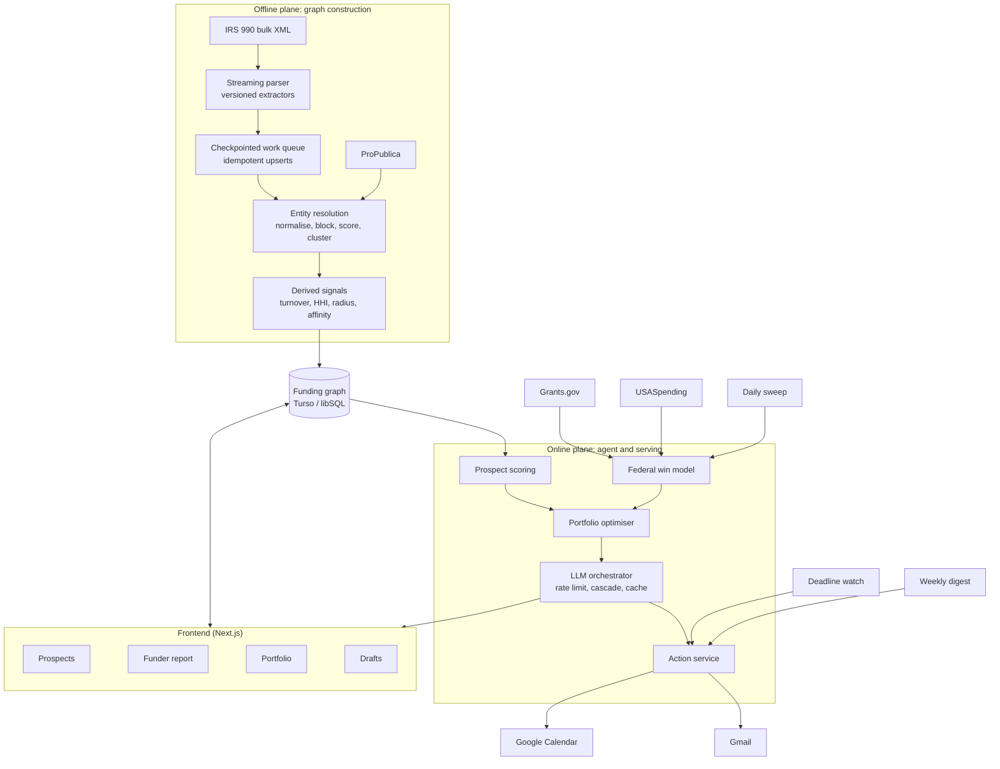

# Solution Design v2: "Merit"

### Mapping the funding graph for small nonprofits

**Author:** Nahom
**Date:** 7 August 2026
**Status:** Revision following review feedback
**Assignment:** AI Automation Assignment, Full Stack AI Web Developer

---

## 0. What changed from v1

v1 proposed an agent that watched federal grant announcements, scored them for fit, and managed deadlines. The feedback was that the feature set was too basic. It was a correct read: v1 filtered a feed. Everything downstream of that was ordinary application code.

v2 changes the thesis.

| | v1 | v2 |
|---|---|---|
| Core question | "Which open grants fit us?" | "Which funders would actually fund us?" |
| Data posture | Feed consumed on a schedule | A national giving graph, built and maintained |
| Coverage | Money that was announced | Money whether or not it was announced |
| Hard problem | None. It was integration work. | Entity resolution over a national corpus |
| Output | A ranked list | A prospect strategy with reachability, ask size, and timing |

The reason for the change is in the next section.

---

## 1. The core insight

Grants.gov contains money that is **openly competed**. That is almost entirely federal, and federal money overwhelmingly flows to large institutions. Our own verification bears this out: the top recipients under the program we sampled were UCLA, Johns Hopkins, and Harvard.

The money a small nonprofit actually lives on is **foundation money**. And the defining fact about foundation money is that most of it is never announced. There is no RFP, no posted deadline, no listing. A tool that watches feeds cannot see it, not because it filters it out, but because there was never anything to see.

However, every private foundation in the United States files a Form 990 that itemises **every grant it made**: recipient, location, purpose, and amount. The IRS publishes these as structured XML, free.

That corpus is the entire US foundation giving graph.

**v1 used it as a lookup table. v2 builds the graph.**

Once the graph exists, questions that were previously unanswerable become computable:

- Which foundations fund organisations genuinely like ours, including ones that have never posted an opportunity?
- Is a given funder even reachable, or has it funded the same organisations for years?
- What is a realistic ask, as opposed to the ceiling printed in a brochure?
- Which organisations are our actual peers, measured by shared funders rather than self-description?

None of these can be answered from a feed. All of them can be answered from the graph.

---

## 2. Role selection and rationale

### 2.1 The role

**Grants Manager / Development Officer at a small nonprofit:** annual budget under roughly $5M, with zero to one dedicated fundraising staff.

### 2.2 Why this role

I worked at **A2SV**, a nonprofit. Fundraising there was not a contained function. We had a hired grant finder, and *the entire team was still regularly pulled into chasing funding.* Engineers stopped engineering to help assemble applications.

The true cost of grant-seeking at a small nonprofit is not the fundraiser's salary. It is **the opportunity cost of everyone else**, spent disproportionately on opportunities the organisation was never positioned to win. Nobody had the time or the data to answer *"is this funder even reachable for us?"* so the default was to apply, and the default was expensive.

### 2.3 The economics of the role

| Benchmark | Price |
|---|---|
| Freelance grant writers | $50-150/hour |
| Ongoing retainer | $2,000-6,000/month |
| In-house grant writer (fully loaded) | ~$98,000/year |
| Candid Foundation Directory / Instrumentl | $179-899/month |

The commercial tools in that last row are built on the same IRS filings this system uses. They charge for access to the graph. The graph itself is public.

---

## 3. Role decomposition and prioritisation

| # | Sub-function | Impact | Automatability | Priority |
|---|---|---|---|---|
| 1 | **Prospect discovery from the giving graph** | **Very high** | **High** | **P0** |
| 2 | **Funder reachability assessment** | **Very high** | **High** | **P0** |
| 3 | Ask-size calibration | High | High | P0 |
| 4 | Federal opportunity screening and fit scoring | High | Very high | P0 |
| 5 | Win-likelihood modelling (federal) | High | High | P0 |
| 6 | Portfolio selection under capacity limits | High | High | P1 |
| 7 | Deadline and milestone management | High | Very high | P1 |
| 8 | Narrative drafting | High | Medium (draft plus human edit) | P1 |
| 9 | Pipeline reporting and forecast | Medium | Very high | P1 |
| 10 | Budget construction | Medium | Low (assist only) | P2 |
| 11 | Post-award reporting | Medium | Medium | Out of scope |
| 12 | Relationship-building with program officers | Very high | **None** | **Stays human** |

Row 12 is stated deliberately. Program-officer relationships, board politics, and the judgement of what the organisation should become are not automatable. Merit is scoped to make the human's limited time land on the right funders, not to replace the human.

---

## 4. Data sources

All sources are free and require no API key or registration. Google Calendar and Gmail use standard OAuth with no billing account. Nothing here requires a credit card. Every source was called live; results are in Appendix A.

| Source | Access | Role |
|---|---|---|
| IRS Form 990 e-file XML | Bulk download, ingested offline | **The giving graph.** Every grant made by every filing foundation |
| ProPublica Nonprofit Explorer | Live | Organisation identity and size. Grounds entity resolution |
| Grants.gov | Live | Federal opportunity feed |
| USASpending.gov | Live | Federal award history for win modelling |
| Google Calendar / Gmail | Live, write | Deadlines and digests |

---

## 5. The funding graph (data platform)

This section is the substance of v2. Everything in §6 is a query against what this section builds.

### 5.1 What the raw data gives us

Each grant record in a 990-PF filing looks like this (verified, Appendix A):

```xml
<GrantOrContributionPdDurYrGrp>
  <RecipientBusinessName>ST PATRICK CATHOLIC SCHOOL</RecipientBusinessName>
  <RecipientUSAddress><CityNm>CORPUS CHRISTI</CityNm><StateAbbreviationCd>TX</StateAbbreviationCd></RecipientUSAddress>
  <RecipientFoundationStatusTxt>PC</RecipientFoundationStatusTxt>
  <GrantOrContributionPurposeTxt>PROGRAM SUPPORT</GrantOrContributionPurposeTxt>
  <Amt>250</Amt>
</GrantOrContributionPdDurYrGrp>
```

The filing identifies the **funder** by EIN. The **recipient** is identified only by a free-text string.

That asymmetry is the central engineering problem of this project, and it is addressed in §5.3.

### 5.2 Ingestion

The corpus is roughly twelve bundles per year, 70 to 210 MB each, containing hundreds of thousands of filings. This cannot be loaded into memory on a free-tier instance, and it cannot complete inside a single request. The pipeline is therefore built as follows:

- **Streaming extraction.** ZIP entries and XML documents are parsed as streams with bounded memory. No full-file buffering.
- **Checkpointed work queue.** Each bundle is decomposed into a job per filing batch, with progress persisted. Runs are expected to be interrupted and resume from the last checkpoint.
- **Idempotent upserts.** Filings are keyed by IRS object ID; reprocessing is a no-op. Retries are safe by construction.
- **Versioned extractors.** The IRS XML schema changes between filing years. Parsing dispatches on the schema version declared in the return, with one extractor per version and an explicit failure when an unknown version appears, rather than silent field loss.
- **Reconciliation check.** Each 990-PF reports total contributions paid as a summary field. Summing the itemised grant records for that filing should approximate it. A large divergence flags an extraction fault for that filing. This gives the pipeline a self-check that does not depend on trusting the parser.

### 5.3 Entity resolution

Grant records name recipients as free text with no identifier. `ST PATRICK CATHOLIC SCHOOL`, `St. Patrick's Catholic School`, and `ST PATRICKS SCH` may be one organisation or three. Until these are resolved, the graph has funders as nodes and unusable strings as leaves, and **every feature in §6 fails.**

The resolution pipeline:

1. **Normalisation.** Case folding, punctuation stripping, legal-suffix removal (INC, LLC, FOUNDATION), leading-article removal, and expansion of a controlled abbreviation dictionary (SCH to SCHOOL, ST to SAINT or STREET by positional heuristic, UNIV to UNIVERSITY).
2. **Blocking.** Pairwise comparison across hundreds of thousands of names is quadratic and infeasible. Candidates are blocked by state plus a phonetic key on the first significant token, reducing comparisons by orders of magnitude.
3. **Scoring.** Within a block, candidate pairs are scored on a weighted combination of token-set similarity, Jaro-Winkler on the normalised string, and address agreement (city, ZIP).
4. **Clustering.** Pairs above threshold are merged with union-find, producing entity clusters.
5. **Grounding.** Each cluster is matched against ProPublica's organisation search to obtain a real EIN, NTEE code, city, state, and financial size. A cluster that grounds to an EIN becomes a fully-typed node in the graph; one that does not remains a weak node, usable for funder-side statistics but not for peer matching.
6. **Confidence and review.** Every merge and grounding carries a confidence score. Low-confidence decisions are queued for review in the UI rather than silently accepted, and reviewed decisions are persisted as training labels for threshold tuning.

Resolution quality is measured, not assumed. See §9.

### 5.4 Derived signals

Once funders, resolved recipients, years, and amounts form a graph, the following are computed per funder. Each is a direct aggregate over the graph, not a model output.

| Signal | Definition | Why it matters |
|---|---|---|
| **Grantee turnover** | Share of a year's grantees not present the prior year, averaged over available years | The single best predictor of whether a newcomer can get in |
| **New-grantee rate** | Count of first-time grantees per year | Distinguishes a funder that adds one newcomer from one that adds thirty |
| **Concentration (HHI)** | Herfindahl index over grant amounts | Separates a funder with one dominant grantee from one spreading evenly |
| **First-time ask size** | Distribution of first grants to new grantees | The realistic ask, as opposed to the advertised ceiling |
| **Geographic radius** | Distribution of funder-to-grantee distance | Reveals whether a funder ever leaves its own region |
| **Program affinity** | NTEE distribution across resolved grantees | What the funder actually funds, from behaviour rather than mission statement |
| **Retention** | Median consecutive years a grantee is retained | Whether a first grant tends to become a relationship |

**Grantee turnover deserves emphasis.** A foundation that funded the same twelve organisations for five consecutive years is saturated, and applying is close to futile regardless of mission fit. A foundation whose grantee list turns over 40% a year is genuinely open. This number predicts outcomes better than anything printed in an announcement, it is computable from public data, and no free tool exposes it.

### 5.5 Peer and prospect discovery

**Peer set.** Given the user's organisation (NTEE, size band, state), retrieve resolved grantees that are similar on program area, budget size band, and region. These are peers by *funding behaviour*, not by self-description.

**Prospect candidates.** Every funder of any peer is a candidate, including funders that have never posted an opportunity anywhere. This is the set that cannot be reached by any feed-based tool.

**Prospect scoring.** Candidates are scored on four explainable components, surfaced separately in the UI so the user sees the reasoning rather than an opaque number:

- *Openness*, from turnover and new-grantee rate
- *Affinity*, from program overlap between the funder's grantee NTEE distribution and the user's profile
- *Geography*, from the funder's historical radius against the user's location
- *Size fit*, from first-time ask distribution against the user's budget

The score is deliberately a transparent weighted combination rather than a learned black box. A development director must be able to defend a prospect list to a board.

---

## 6. Functional requirements

### F1. Organisation profile

Mission, program areas, NTEE code, EIN, 501(c)(3) status, budget, geography served, applicant type, past awards, and reusable boilerplate. Where an EIN is supplied, the organisation is located in the graph directly and its own funding history is imported.

### F2. Prospect discovery

Ranked foundation prospects from §5.5, each with openness, affinity, geography, and size-fit shown as separate components with the underlying grantees inspectable.

### F3. Funder reachability report

Per funder: turnover, new-grantee rate, concentration, retention, geographic radius, program mix, and the full grantee list by year. This is the "should we bother" view.

### F4. Ask-size calibration

Recommended ask derived from the funder's first-time grant distribution, filtered to grantees in the user's size band.

### F5. Federal opportunity ingestion and screening

Scheduled Grants.gov sweep, deduplicated, with deterministic eligibility screening on applicant type, 501(c)(3) status, geography, and entity country before any model call.

### F6. Fit scoring

Surviving opportunities scored against the profile by Gemini with schema-validated output: score, rationale, matched program areas, gaps.

### F7. Federal win-likelihood modelling

For each high-fit opportunity, build a peer cohort from USASpending award history under the same federal program identifier, then compute recipient size distribution, award rate for organisations in the user's band, median award against advertised ceiling, repeat-recipient concentration, and trend. The model produces the estimate; Gemini only explains it.

### F8. Portfolio selection

Expected value per pursuit is award size multiplied by modelled win probability. The constraint is a single honest input from the user: how many applications the organisation can realistically submit this quarter. Optimising selection under that constraint returns a recommended set, the expected return, and explicitly what is given up.

*(v1 proposed constraining on staff hours. That was rejected: both the hours available and the hours required would have been numbers the user invented, making the output a chart of two guesses. Application count is a figure a development office actually knows.)*

### F9. Deadline backward-planning

Milestones computed backward from close dates and written to Google Calendar with reminders.

### F10. Narrative drafting

Need statement, organisational capacity, and program description generated from the profile and the opportunity. For foundation prospects, drafting is additionally conditioned on the funder's observed purpose language across its grantee history. Always a draft; never auto-submitted.

### F11. Pipeline and forecast

Pipeline stages with expected value summed across live pursuits against the annual target. Every input to the forecast is either a real award figure or a modelled probability with visible provenance.

### F12. Notifications and digests

High-fit alerts, weekly ED briefing, at-risk deadline warnings.

---

## 7. LLM orchestration under a hard quota

The Gemini free tier allows 15 requests per minute and 1,500 per day. A sweep can surface hundreds of opportunities, and drafting is token-heavy. The constraint is real and forces a genuine orchestration layer rather than direct API calls.

- **Token-bucket rate limiting** with a priority queue, so interactive user requests preempt background sweeps.
- **Cascade.** Deterministic filters run first and reject the majority at zero model cost. Cheap classification runs next. Expensive generation runs only on what survives.
- **Content-hash caching.** Identical profile and opportunity pairs never pay twice.
- **Structured output with a repair loop.** Responses are schema-validated; on failure the model is re-prompted with the validation error before the call is abandoned.
- **Degradation.** On quota exhaustion the system serves persisted assessments and queues new work rather than failing.
- **Telemetry.** Per-run token, cost, and latency accounting, surfaced in the run log.

---

## 8. Architecture

Two planes. The **offline plane** builds the graph. The **online plane** serves queries against it and runs the daily agent.



### 8.1 Stack

| Layer | Choice | Rationale |
|---|---|---|
| Frontend | Next.js 14 App Router, TypeScript, Tailwind | Server components suit read-heavy graph views |
| Backend | Next.js API routes plus job handlers on Cloud Run | Single deployable, Always Free tier |
| Offline jobs | Node workers, checkpointed, resumable | Bounded memory over a multi-gigabyte corpus |
| Scheduler | Cloud Scheduler, 3 jobs | Always Free |
| Database | Turso / libSQL | Free without a card. The graph queries are analytical joins and aggregations, which is exactly what SQL is for |
| LLM | Gemini 2.5 Flash | Free tier, structured output |
| Validation | Zod | Every model response and every parsed filing is schema-checked |

---

## 9. Evaluation and quality

A system that produces recommendations must be able to show that the recommendations are sound. This is treated as a first-class component, not an afterthought.

**Entity resolution evaluation.** A hand-labelled set of name pairs, both matches and near-miss non-matches. Precision and recall reported per release, with thresholds tuned against it. Resolution errors propagate into every downstream feature, so this is the metric that matters most.

**Fit-scoring evaluation.** A golden set of profile and opportunity pairs with human labels. Precision and recall on the high-fit classification, plus score correlation.

**Prospect ranking sanity check.** For organisations already present in the graph with known funders, hold out their real funders and measure whether the recommender surfaces them. This is a genuine offline evaluation on real outcomes, available before a single user exists.

**Regression gate.** Metrics run in CI. A drop beyond tolerance fails the build.

**Reconciliation.** The ingestion self-check in §5.2 runs continuously and reports parse-fault rates per schema version.

---

## 10. Proactive automation

| Job | Cadence | Behaviour |
|---|---|---|
| **Daily sweep** | 06:00 | Ingest federal opportunities, screen, score, model win likelihood, alert only above threshold |
| **Deadline watch** | 07:00 | Milestone health, escalation, at-risk warnings |
| **Weekly digest** | Monday 08:00 | ED briefing: forecast against target, new prospects surfaced from the graph, decisions needed this week |

Graph rebuilds run as offline jobs outside the scheduler budget, triggered on new IRS bundle publication.

---

## 11. Actions the agent takes

| Action | Integration | Trigger | Human control |
|---|---|---|---|
| Create deadline milestones | Google Calendar | Pursuit accepted | Reviewed before commit |
| Send high-fit alert | Gmail | Daily sweep above threshold | Threshold configurable |
| Send weekly briefing | Gmail | Schedule | Recipients configurable |
| Send at-risk warning | Gmail | Milestone slip | n/a |
| Draft narrative | Gemini | On request | Always human-edited, never auto-submitted |
| Record bid/no-bid | Internal | After modelling | Override with reason |

The agent may inform, schedule, and draft autonomously. It never submits an application and never contacts a funder.

---

## 12. UI and interaction model

1. **Prospect list.** The primary surface. Ranked funders with openness, affinity, geography, and size fit shown as separate bars.
2. **Funder report.** Turnover over time, grantee list by year, ask-size distribution, geographic spread, program mix. The "should we bother" view.
3. **Peer view.** Organisations sharing your funders, and what they receive.
4. **Federal opportunity board.** Fit score with award-history evidence behind the win estimate.
5. **Portfolio planner.** Recommended pursuit set under the quarterly application constraint, with what is given up made explicit.
6. **Draft editor.** Narrative beside requirements.
7. **Forecast.** Expected value against annual target, with provenance on every input.
8. **Resolution review queue.** Low-confidence entity merges surfaced for human confirmation. This is an operational surface that also demonstrates the system knows what it is unsure about.

---

## 13. Data model (core tables)

```
organizations        profile, EIN, NTEE, budget band, geography, boilerplate
funders              ein, name, state, assets, total_paid, filing_years[]
grant_records        funder_ein, raw_recipient_name, address, purpose, amount, tax_year
entities             entity_id, canonical_name, ein, ntee, size_band, state, confidence
entity_members       entity_id, grant_record_id, match_score
funder_signals       funder_ein, turnover, new_grantee_rate, hhi, radius, retention, ask_p50
prospects            org_id, funder_ein, openness, affinity, geography, size_fit, total
opportunities        id, title, agency, program_number, dates, synopsis, status
assessments          opportunity_id, fit_score, rationale, eligibility, win_probability
pursuits             target_ref, stage, expected_value, milestones[], calendar_event_ids[]
ingest_checkpoints   bundle, offset, status, schema_version, fault_count
eval_runs            metric, value, commit, timestamp
llm_calls            purpose, tokens, cost, latency, cache_hit
```

---

## 14. Free-tier compliance

- No credit card at any point.
- GCP: Cloud Run and Cloud Scheduler (3 jobs). No Cloud SQL.
- Gemini free tier respected by the orchestration layer in §7, not by hope.
- IRS, ProPublica, Grants.gov, USASpending: free, unauthenticated.
- Google Calendar and Gmail: OAuth, no billing account.
- Turso: free tier.

---

## 15. Scope

**Must work end to end**
Graph ingestion over at least one full year of bundles · entity resolution with measured precision and recall · derived funder signals · prospect discovery and scoring · funder reachability report · federal sweep with eligibility screening and fit scoring · win modelling · calendar milestones · digests · three scheduled jobs · eval harness.

**High value, contained risk**
Portfolio optimiser · ask-size calibration · forecast · resolution review queue.

**Deferred**
Multi-tenant hardening · full multi-year corpus · budget construction · post-award reporting · state and local opportunity sources.

---

## 16. Risks and mitigations

| Risk | Severity | Mitigation |
|---|---|---|
| Entity resolution quality is poor, corrupting every downstream feature | **High** | Measured against a labelled set with precision and recall gated in CI; low-confidence merges are surfaced for review rather than silently accepted; weak nodes still serve funder-side statistics |
| Ingestion does not complete within free-tier limits | **High** | Streaming parse, checkpointed resumable jobs, bounded memory; scope degrades to fewer bundles without changing correctness |
| Prospect recommendations are plausible but wrong | High | Held-out evaluation against organisations with known funders; every score component is shown separately with underlying grantees inspectable |
| Gemini quota exhaustion | Medium | Cascade, caching, priority queue, graceful degradation to persisted results |
| 990 data lags one to two years | Low | Inherent. Positioned as structural intelligence about funder behaviour, which changes slowly; the federal feed supplies real-time |
| Foundations that do not e-file are absent | Low | Stated in-product. Coverage of e-filers is complete |

---

## 17. Success criteria

1. The graph is built from real IRS bundles, with entity resolution precision and recall reported as numbers.
2. For a real nonprofit profile, the system surfaces foundations that fund comparable organisations and that do not appear in any opportunity feed.
3. For any funder, the system reports grantee turnover and a realistic first-time ask from filed data.
4. Held-out evaluation shows the recommender recovering known funders for organisations already in the graph.
5. Federal opportunities are screened, scored, and accompanied by a win estimate grounded in award history.
6. A scheduled job sends a real digest and writes real calendar milestones with no user interaction.
7. Frontend and backend are both substantive, with the graph views as working surfaces rather than charts.

### Demo narrative

> *"You have never heard of this foundation, because it has never posted an opportunity. It funded eleven organisations last year, four of them within sixty miles of you, all in youth mental health, all with budgets close to yours. It replaces about a third of its grantees each year, so it is genuinely open. First grants to newcomers cluster around $40,000. Here is the draft, and the deadline is on your calendar."*

No feed-based tool can produce that sentence.

---

## Appendix A: Data verification

Every source was called live on **6 August 2026**. No source requires an API key.

### 1. IRS Form 990 e-file XML (the graph)

`https://apps.irs.gov/pub/epostcard/990/xml/2026/2026_TEOS_XML_01A.zip` returned HTTP 200, 69 MB. Parsed contents of that single monthly bundle:

- **12,245** filings
- **786** foundations reporting itemised grants
- **11,670** individual grant records
- 344 grants in the largest single filing
- 53 records with foreign recipients and country codes

Twelve bundles are published per year, 70 to 210 MB each. Record structure is quoted in §5.1: recipient name, full address, foundation status, purpose, and amount, with the filer identified by EIN.

### 2. ProPublica Nonprofit Explorer (identity grounding)

Returns ten years of financial history per organisation. Robert Wood Johnson Foundation, FY2023: **$551.2M** in grants paid against **$13.7B** in assets, flagged non-operating, grants to individuals permitted. Organisation search returns EIN, NTEE, city, and state, which is what entity clusters are grounded against.

Two findings that shaped the design: ProPublica returns financial **summaries only**, not itemised grantee lists, and its filing-PDF endpoint refuses programmatic requests (HTTP 403). Grantee-level data therefore comes from the IRS directly, and PDF extraction is not used anywhere in this system.

### 3. Grants.gov

Searching `"youth mental health"` returned **971 matching opportunities**, each carrying agency, status, dates, and a federal program number:

```json
{ "hitCount": 971,
  "oppHits": [{
     "title": "…Empirically-Supported Practices for Youth Mental Health (R01…)",
     "agency": "National Institutes of Health",
     "openDate": "12/03/2024", "closeDate": "01/07/2027",
     "oppStatus": "posted", "cfdaList": ["93.242"] }] }
```

The detail endpoint returns the full announcement: description, eligibility, award ceiling and floor, expected number of awards, and agency contacts.

### 4. USASpending (federal win modelling)

USASpending accepts the same program number that Grants.gov returns. Filtering on `93.242` returned real historical awards:

| Recipient | Award |
|---|---|
| University of California, Los Angeles | $973,507,476 |
| Johns Hopkins University | $276,059,720 |
| Harvard College | $213,206,023 |

Because both systems key on the same identifier, an open opportunity can be linked to every award ever made under the same program. These recipients also illustrate §1: openly competed federal money concentrates in large institutions, which is why the foundation graph is the more valuable asset for a small nonprofit.

**Not verified:** Google Calendar and Gmail are standard OAuth integrations requiring no billing account. They are assumed rather than tested, and are the only unverified dependencies in this design.
