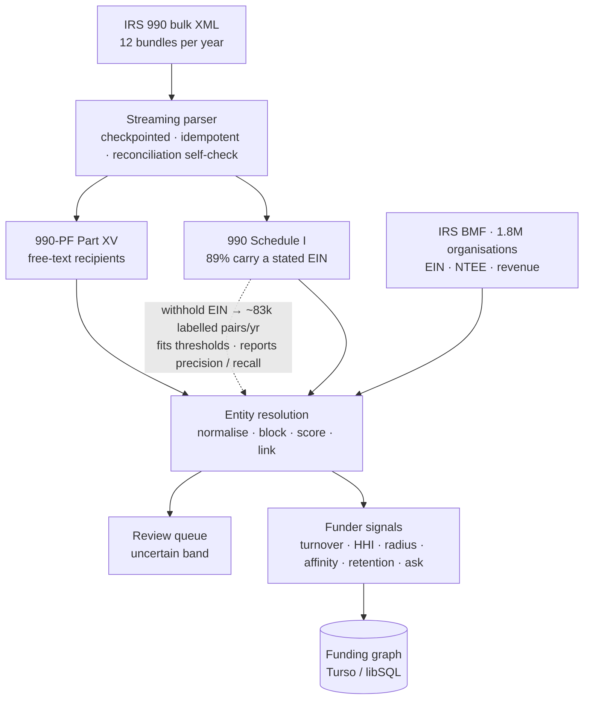
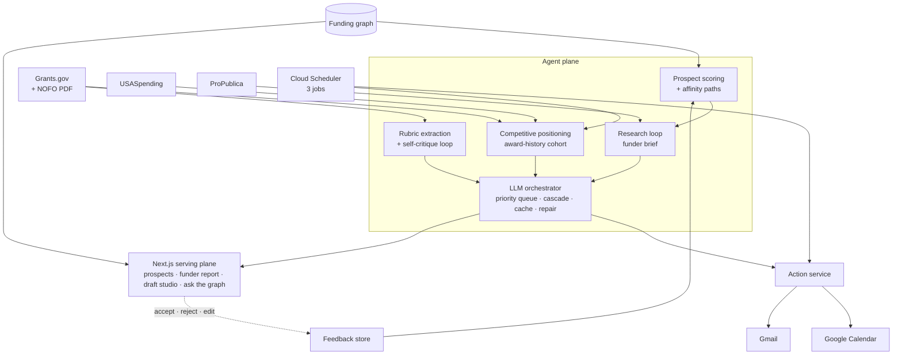

# Merit

### The funding graph and the agent that works it, for small nonprofits

**Author:** Nahom
**Date:** 7 August 2026
**Status:** Solution design, for review and approval before implementation
**Assignment:** AI Automation Assignment, Full Stack AI Web Developer

---

> *"You have never heard of this foundation, because it has never posted an opportunity anywhere. Last year it funded eleven organisations. Four of them are within sixty miles of you, all in youth services, all with budgets within a band of yours. It replaces about a third of its grantee list every year, so it is genuinely open to newcomers, and first grants to newcomers cluster around $40,000. Two of those eleven organisations already share a funder with you. I have drafted the letter of inquiry against the language this foundation actually funds, the ask is set at $45,000, and the deadline is on your calendar."*
>
> No opportunity feed can produce that paragraph. Every fact in it is computable from free public data.

---

## 1. Executive summary

**Merit is an AI Development Officer for nonprofits with a budget under $5M and zero to one fundraising staff.**

It is built on a claim that decides the entire architecture: **the money a small nonprofit actually lives on is never announced.** Federal grants are posted, competed, and overwhelmingly won by large institutions. Foundation money — the money that actually sustains a small organisation — has no RFP, no listing, and no deadline to watch. A tool built on feeds cannot see it, not because it filters it out, but because there is nothing to see.

But every grant-making organisation in the United States files a tax return that itemises **every grant it made**: recipient, address, purpose, amount. The IRS publishes these as structured XML, in bulk, free. That corpus is the US foundation giving graph. Commercial products charge $179–899/month for access to it.

Merit builds that graph, and then puts an agent to work on it:

| Layer | What it does |
|---|---|
| **The graph** | Ingest the national 990 corpus, resolve free-text recipient names to real organisations, and compute behavioural signals per funder — openness, ask size, geographic reach, program affinity, retention |
| **The agent** | Find prospects no feed can see, judge whether each is reachable, calibrate the ask, screen federal opportunities, draft against the funder's own language and the announcement's actual scoring rubric, critique its own drafts, plan deadlines, and report — on a schedule, unprompted |
| **The loop** | Every accept, reject, and override retunes the model of what this organisation should pursue |

Every data source and every technical claim in this document was verified live on **7 August 2026**. Results, including two findings that changed the design, are in **Appendix A**.

---

## 2. The role

### 2.1 Who is being automated

**Grants Manager / Development Officer at a small nonprofit.** Annual budget under roughly $5M, zero to one dedicated fundraising staff.

### 2.2 Why this role

I worked at **A2SV**, a nonprofit. Fundraising there was not a contained function. We had a hired grant finder, and *the entire team was still regularly pulled into chasing funding.* Engineers stopped engineering to help assemble applications.

That is the insight behind this project. The true cost of grant-seeking at a small nonprofit is not the fundraiser's salary. It is **the opportunity cost of everyone else**, spent disproportionately on money the organisation was never positioned to win. Nobody had the time or the data to answer *"is this funder even reachable for us?"*, so the default was to apply, and the default was expensive.

### 2.3 The economics

| Benchmark | Price |
|---|---|
| Freelance grant writers | $50–150/hour |
| Ongoing retainer | $2,000–6,000/month |
| In-house grant writer, fully loaded | ~$98,000/year |
| Candid Foundation Directory / Instrumentl | $179–899/month |

The commercial tools in that last row are built on the same IRS filings this system uses. They charge for access to the graph. **The graph itself is public.**

### 2.4 Why an agent beats a human at this specific work

A human development officer cannot read 12,000 tax filings a month, cannot compute a funder's five-year grantee turnover, and cannot hold the giving patterns of a national corpus in their head. Those are not human tasks. They are also precisely the tasks that determine whether an application is worth writing.

Merit is designed so the agent **knows things the organisation cannot know unaided**:

1. Which foundations fund organisations genuinely like this one — including foundations that have never posted anything, anywhere.
2. Whether a given funder is actually open to a newcomer, or has quietly funded the same twelve organisations for six years.
3. What a realistic first ask is, as opposed to the ceiling printed in a brochure.
4. What an announcement's reviewers are actually scored on, and how a draft measures against it before a human reads it.

That asymmetry is what makes the agent worth hiring.

---

## 3. Role decomposition and prioritisation

| # | Sub-function | Impact | Automatability | Priority |
|---|---|---|---|---|
| 1 | **Prospect discovery from the giving graph** | **Very high** | **High** | **P0** |
| 2 | **Funder reachability assessment** | **Very high** | **High** | **P0** |
| 3 | **Rubric-grounded drafting and self-critique** | **Very high** | **High** | **P0** |
| 4 | Ask-size calibration | High | High | P0 |
| 5 | Federal opportunity screening and fit scoring | High | Very high | P0 |
| 6 | Competitive positioning against award history | High | High | P0 |
| 7 | Deadline and milestone management | High | Very high | P1 |
| 8 | Portfolio shortlisting under capacity limits | High | High | P1 |
| 9 | Pipeline reporting and forecast | Medium | Very high | P1 |
| 10 | Budget construction | Medium | Low (assist only) | P2 |
| 11 | Post-award reporting and compliance | Medium | Medium | Out of scope |
| 12 | Relationship-building with program officers | Very high | **None** | **Stays human** |

**Row 12 is stated deliberately.** Program-officer relationships, board politics, and the judgement of what the organisation should become are not automatable, and a design claiming otherwise would be dishonest about the role. Merit is scoped to make the human's limited time land on the right funders with the right materials — not to replace the human.

Rows 1–3 sit at the top on purpose. Discovery of *posted* opportunities is a commodity that free alert services already provide badly. The expensive judgement is **who to approach, whether they are reachable, and whether the document is any good** — and that is what a $150/hour consultant is actually being paid for.

---

## 4. Data sources

Every source is free and requires **no API key and no registration**. Google Calendar and Gmail use standard OAuth with no billing account. Nothing in this system requires a credit card. All were called live; see Appendix A.

| Source | Access | Role in the system |
|---|---|---|
| **IRS 990 e-file XML** (bulk) | Keyless bulk download | **The giving graph.** Itemised grants from 990-PF Part XV and Form 990 Schedule I |
| **IRS Exempt Organizations BMF** (bulk CSV) | Keyless bulk download | **The canonical organisation dictionary.** EIN, name, address, NTEE, revenue and asset bands |
| **Grants.gov** search + detail + attachments | Keyless | Federal opportunities, and the **full announcement PDF** carrying the scoring rubric |
| **USASpending.gov** | Keyless | Federal award history, keyed on the same program number Grants.gov returns |
| **ProPublica Nonprofit Explorer** | Keyless | Funder financial trend and capacity, per organisation |
| **Google Calendar / Gmail** | OAuth, write | Milestones and digests |

---

## 5. The funding graph

This section is the data platform. Everything the agent does in §6 is a query against what this section builds.

### 5.1 What the corpus actually contains

One monthly IRS bundle was downloaded and fully parsed (71 MB compressed, 379 MB expanded, **12,245 filings**). Composition:

| Return type | Filings | With itemised grants | Grant records |
|---|---|---|---|
| Form 990-PF (private foundations) | 1,057 | 786 | **11,670** |
| Form 990 Schedule I (grant-making public charities) | 7,180 | 875 | **7,777** |
| Form 990-EZ | 3,687 | — | — |
| Form 990-T | 321 | — | — |

**Both grant tables matter, and the second one is usually missed.** Form 990 Schedule I is filed by public charities that regrant — community foundations, United Ways, federated funders, intermediaries. For a small local nonprofit these are frequently *more* reachable than private foundations. Including Schedule I adds 111% more funders and 67% more grant records than the 990-PF table alone.

Across twelve bundles a year, this is on the order of **20,000 grant-making organisations and 230,000 itemised grant records annually.**

### 5.2 The asymmetry that defines the engineering problem

The two tables identify recipients differently, and that difference drives the whole design.

**990-PF Part XV** — recipient is a bare string, no identifier:

```xml
<GrantOrContributionPdDurYrGrp>
  <RecipientBusinessName>ST PATRICK CATHOLIC SCHOOL</RecipientBusinessName>
  <RecipientUSAddress><CityNm>CORPUS CHRISTI</CityNm><StateAbbreviationCd>TX</StateAbbreviationCd></RecipientUSAddress>
  <RecipientFoundationStatusTxt>PC</RecipientFoundationStatusTxt>
  <GrantOrContributionPurposeTxt>PROGRAM SUPPORT</GrantOrContributionPurposeTxt>
  <Amt>250</Amt>
</GrantOrContributionPdDurYrGrp>
```

**Form 990 Schedule I** — recipient carries a real EIN:

```xml
<RecipientTable>
  <RecipientBusinessName><BusinessNameLine1Txt>American Vein &amp; Lymphatic Society</BusinessNameLine1Txt></RecipientBusinessName>
  <USAddress><AddressLine1Txt>434 W Ontario St STE 200</AddressLine1Txt>
    <CityNm>Chicago</CityNm><StateAbbreviationCd>IL</StateAbbreviationCd><ZIPCd>60654</ZIPCd></USAddress>
  <RecipientEIN>330180128</RecipientEIN>
  <PurposeOfGrantTxt>Education and Research</PurposeOfGrantTxt>
</RecipientTable>
```

**6,917 of the 7,777 Schedule I records — 89% — carry a `RecipientEIN`.** The 990-PF records carry none.

Until the 990-PF strings are resolved to real organisations, the graph has funders as nodes and unusable text as leaves, and every feature in §6 fails. Entity resolution is therefore not a detail of this system. It is the system.

### 5.3 Ingestion

The corpus is roughly twelve bundles a year at 70–210 MB each, hundreds of thousands of filings. It cannot be held in memory on a free-tier instance and cannot complete inside a single request.

- **Streaming extraction.** ZIP entries and XML documents are parsed as streams with bounded memory. No full-file buffering at any point.
- **Checkpointed work queue.** Each bundle decomposes into jobs per filing batch with persisted progress. Runs are *expected* to be interrupted and resume from the last checkpoint. This is a design assumption, not a failure path.
- **Idempotent upserts.** Filings are keyed by IRS object ID. Reprocessing is a no-op, so retries are safe by construction.
- **Two extractors, dispatched by return type.** 990-PF Part XV and 990 Schedule I have different shapes and different guarantees. An unrecognised schema version raises rather than silently dropping fields.
- **Reconciliation self-check.** 990-PF filings report total contributions paid as a summary field, present in 898 of the filings in the sample bundle. Summing the itemised records for a filing should approximate it; a material divergence flags an extraction fault for that filing. **This gives the pipeline a correctness signal that does not depend on trusting the parser** — parse-fault rate is measured, not assumed.

### 5.4 Entity resolution, anchored to a canonical dictionary

The naive approach is to cluster the recipient strings against each other and hope the clusters are organisations. That is unbounded, unmeasurable, and produces clusters with no NTEE code, no budget, and no address — which is to say, nothing the scoring in §5.6 can actually use.

Merit does the opposite. The IRS publishes the **Exempt Organizations Business Master File** as a keyless bulk CSV covering every registered exempt organisation in the country, with exactly the fields the system needs:

```
EIN, NAME, ICO, STREET, CITY, STATE, ZIP, SUBSECTION, FOUNDATION,
ASSET_CD, INCOME_CD, ASSET_AMT, INCOME_AMT, REVENUE_AMT, NTEE_CD, SORT_NAME
```

This converts an open-ended clustering problem into **record linkage against a known target set** — a bounded problem with a defined right answer. The pipeline:

1. **Normalisation.** Case folding, punctuation stripping, legal-suffix removal (`INC`, `LLC`, `FOUNDATION`, `TRUST`), leading-article removal, and expansion of a controlled abbreviation dictionary (`SCH`→`SCHOOL`, `UNIV`→`UNIVERSITY`, `ST`→`SAINT` or `STREET` by positional heuristic). Applied identically to both sides.
2. **Blocking.** Pairwise comparison against ~1.8M BMF rows is infeasible. Candidates are blocked on state plus a phonetic key over the first significant token, reducing comparison volume by orders of magnitude.
3. **Scoring.** Within a block, candidates are scored on a weighted combination of token-set similarity, Jaro-Winkler over the normalised string, and address agreement (city, ZIP).
4. **Decision.** Above a high threshold, link. Below a low threshold, reject. Between them, queue for human review rather than guessing.
5. **Payoff.** A linked record inherits the BMF's EIN, NTEE code, city, state, and revenue — which is exactly the input the affinity, geography, and size-fit scores need. Unlinked records remain weak nodes: still usable for funder-side statistics such as grant counts and amounts, but excluded from peer matching.

### 5.5 The corpus labels its own hardest problem

This is the part of the design I am most confident about, and it falls directly out of the finding in §5.2.

Schedule I gives **6,917 records per bundle** in which a filer wrote a messy free-text nonprofit name *and* stated the correct EIN. That is not merely data. **It is a labelled training and evaluation set for the resolver, produced by the same corpus, at no cost.**

For each Schedule I record: take the free-text name and address, discard the EIN, run the full §5.4 pipeline, and compare the predicted EIN to the withheld true one. Repeat across bundles and there are roughly **83,000 labelled linkage pairs per year** — orders of magnitude more than any hand-labelled set a single engineer could build, and drawn from exactly the population of messy names the system must handle.

This yields three things at once:

- **Precision and recall as measured numbers**, per release, on real labels rather than a curated toy set.
- **Threshold tuning with a real curve.** The high/low thresholds in §5.4 step 4 are fitted against the labelled set, not chosen by feel.
- **Hard negatives for free.** Near-miss non-matches are mined from within the same blocking buckets — the cases that actually break a resolver.

**Stated honestly:** Schedule I filers are public charities and 990-PF filers are private foundations, so there is mild distribution shift between the labelled population and the target population. This is measured rather than assumed — a held-out hand-labelled sample of 990-PF records validates that the Schedule-I-fitted thresholds transfer, and the gap is reported rather than hidden.

### 5.6 Derived signals

Once funders, resolved recipients, years, and amounts form a graph, the following are computed per funder. Each is a direct aggregate over the graph — arithmetic, not model output.

| Signal | Definition | Why it matters |
|---|---|---|
| **Grantee turnover** | Share of a year's grantees absent the prior year, averaged over available years | The single best predictor of whether a newcomer can get in |
| **New-grantee rate** | Count of first-time grantees per year | Distinguishes a funder that adds one newcomer from one that adds thirty |
| **Concentration (HHI)** | Herfindahl index over grant amounts | Separates a funder with one dominant grantee from one spreading evenly |
| **First-time ask size** | Distribution of first grants to new grantees | The realistic ask, as opposed to the advertised ceiling |
| **Geographic radius** | Distribution of funder-to-grantee distance | Reveals whether a funder ever leaves its own region |
| **Program affinity** | NTEE distribution across resolved grantees | What the funder actually funds, from behaviour rather than mission statement |
| **Retention** | Median consecutive years a grantee is retained | Whether a first grant tends to become a relationship |

**Grantee turnover deserves emphasis.** A foundation that funded the same twelve organisations for five consecutive years is saturated, and applying is close to futile regardless of how well the mission matches. A foundation whose grantee list turns over 40% a year is genuinely open. This number predicts outcomes better than anything printed in an announcement, it is computable from public data, and **no free tool exposes it.**

### 5.7 Peers, prospects, and affinity paths

**Peer set.** Given the organisation's NTEE code, revenue band, and state, retrieve resolved grantees similar on program area, size, and region. These are peers by *funding behaviour*, not by self-description — which is the only definition that predicts anything.

**Prospect candidates.** Every funder of any peer is a candidate, **including funders that have never posted an opportunity anywhere.** This is the set that no feed-based tool can reach, and it is the product.

**Prospect scoring.** Four components, surfaced separately in the UI so the user sees reasoning rather than an opaque number:

- *Openness* — from turnover and new-grantee rate
- *Affinity* — program overlap between the funder's grantee NTEE distribution and the organisation's profile
- *Geography* — the funder's historical radius against the organisation's location
- *Size fit* — first-time ask distribution against the organisation's budget

The composite is a transparent weighted sum, deliberately not a learned black box. **A development director has to defend a prospect list to a board**, and "the model said so" is not a defence. The weights are tunable, and §6.5 tunes them from user behaviour.

**Affinity paths.** Because the graph has real edges, it can answer a question no list can: *how close is this funder to us already?* If Funder X funds Peer A, and Peer A shares two funders with us, that is a traceable path through the giving graph. Development work runs on warm approaches, and this is the closest thing to one that public data supports. It is presented as exactly that — shared-funder proximity, not a personal connection — because overselling it would be the kind of claim that destroys trust in everything else on the screen.

---

## 6. The agent

The graph is the asset. This section is the employee. Each capability below is a multi-step, tool-using loop with persisted state — not a single model call behind a button.

### 6.1 Rubric-grounded drafting with self-critique

**This is the capability that most directly replaces paid human labour**, and a live probe confirmed it is buildable from public data.

Federal announcements are scored against a published rubric with explicit point allocations. The Grants.gov synopsis does not contain it — the synopsis for the opportunity tested was 1,068 characters — but the **full announcement PDF is downloadable through a keyless Grants.gov endpoint**, and it does. From a real, currently-open announcement (Appendix A.3):

```
Criteria summary                                          Total number of points = 110
  1. Purpose and Need (Need for assistance)                            5 points
  2. Impact (Objectives, expected outcomes, performance evaluation)   20 points
  3. Response (Approach)                                              40 points
  4. Resources and capabilities (Organizational capacity, oversight)  20 points
  5. Support requested (Budget)                                       10 points
  6. Resources and capabilities (Sustainability plan)                  5 points
  7. ACF priority alignment                                           10 points
```

The body then decomposes each criterion into individually scored sub-questions (`0 to 15 points`, `0 to 5 points`, and so on).

The agent loop:

1. **Extract** the rubric into a structured object — criteria, sub-criteria, maximum points, and the reviewer instructions attached to each.
2. **Draft** each narrative section from the organisation profile, conditioned on the sub-criteria that section is scored against.
3. **Self-critique.** A separate pass scores the draft against each criterion and must cite the specific sentence supporting each score. Unsupported scores are rejected by the validator.
4. **Revise** the weakest-scoring sections, weighted by points available — a 40-point criterion earns revision effort that a 5-point criterion does not.
5. **Report** to the user: per-criterion score before and after, what changed, and which criteria remain weak **because they need a fact only a human has**, such as an unmeasured outcome or an unsigned partnership.

Step 5 is the point. The output is not a wall of generated prose; it is a marked-up draft that tells a development director exactly where their remaining hours should go. That is what the consultant is being paid for.

For **foundation** prospects — where no rubric exists, because nothing was announced — drafting is conditioned instead on the funder's observed purpose language across its own grantee history, drawn from the graph.

### 6.2 The prospect research loop

A high-scoring prospect triggers a multi-step investigation before it is shown as a recommendation:

1. Pull the funder's full grantee history from the graph, by year.
2. Pull the financial trend and capacity from ProPublica — is giving rising or falling, and is there a payout obligation to meet.
3. Compute the signals in §5.6 over the funder's own history.
4. Trace affinity paths to the organisation's existing funders.
5. Synthesise a **funder brief**: who they fund, whether they are open, what to ask for, what to lead with, and — stated explicitly — what the evidence does *not* support.

Every claim in the brief carries a citation back to a filing, and the UI makes the underlying grantee rows inspectable. The agent is required to show its work.

### 6.3 Competitive positioning on federal opportunities

For any high-fit federal opportunity, the agent joins to USASpending on the program number Grants.gov returns and builds a cohort of past winners: recipient size distribution, median award against advertised ceiling, awards per cycle, repeat-recipient concentration, and trend.

**An honest statement about what this number is.** Public data records who *won*. It never records who applied and lost. There is no denominator anywhere in the federal data, so anything called a "win probability" would be fabricated. Merit therefore reports a **competitive base rate** — how organisations of this size and type have historically fared under this program — and says plainly that it is a base rate over winners, not a probability of success. The pipeline forecast in §6.6 inherits that caveat rather than laundering it into a number that looks more certain than it is.

The practical effect is unchanged and still decisive: a $2M program that has gone to a major research university every year for six years is not a realistic target for a $600k community organisation, however well the mission matches. The agent says so, and shows the award history behind the call.

### 6.4 Conversational access to the graph

A chat surface with tool access to the graph, so the user can ask questions the UI does not anticipate:

> *"Which funders gave to two or more of my peers last year?"*
> *"Has anyone under $1M in revenue ever received money from this foundation?"*
> *"Show me funders in Ohio that increased giving three years running."*

The model does not see raw tables. It calls typed, parameterised query tools; results are rendered as inspectable rows with the generating query shown. This is deliberate: it keeps the model away from SQL injection surface, keeps answers grounded in real rows, and makes every answer auditable.

### 6.5 Learning from the user

Every accept, reject, and override is a labelled example, captured with the reason.

- **Prospect feedback** retunes the §5.7 component weights for that organisation. A development director who consistently rejects out-of-state funders shifts their own geography weight without being asked to configure anything.
- **Draft edits** are diffed against generated text. Persistent edits — a phrase always removed, a framing always rewritten — are folded into that organisation's drafting profile.
- **Bid/no-bid overrides** are recorded against the agent's recommendation, producing a running, visible measure of where the agent and the human disagree.

This is the difference between a report generator and an employee. A report is the same on day 200 as on day 1.

### 6.6 Portfolio shortlisting

Given a single honest input — how many applications the organisation can realistically submit this quarter — the agent ranks live pursuits by expected value and returns a recommended set, the expected return, and **explicitly what is being given up.**

*Two deliberate design decisions here.* First, the constraint is application count, not staff hours: hours available and hours required would both be numbers the user invented, making the output a chart of two guesses, whereas application count is a figure a development office actually knows. Second, this is presented as a ranked shortlist rather than an "optimiser" — under a count constraint with no interaction between pursuits, the optimal solution is a sort, and dressing a sort in the language of optimisation would oversell it.

### 6.7 LLM orchestration under a hard quota

The Gemini free tier allows 15 requests per minute and 1,500 per day. A sweep can surface hundreds of opportunities and the self-critique loop in §6.1 is multi-pass and token-heavy. The constraint is real, and it forces a genuine orchestration layer rather than scattered API calls.

- **Token-bucket rate limiting with a priority queue.** Interactive user requests preempt background sweeps. A user waiting on a chat response does not queue behind a nightly job.
- **Cascade.** Deterministic filters run first and reject the majority at zero model cost. Cheap classification runs next. Expensive generation and critique run only on what survives.
- **Content-hash caching.** Identical profile-and-opportunity pairs never pay twice.
- **Structured output with a repair loop.** Every response is schema-validated; on failure the model is re-prompted with the specific validation error before the call is abandoned.
- **Graceful degradation.** On quota exhaustion the system serves persisted assessments and queues new work. It does not fail; it gets slower.
- **Telemetry.** Per-call purpose, token count, latency, and cache-hit rate, surfaced in the run log.

---

## 7. Functional requirements

| ID | Requirement |
|---|---|
| **F1** | **Organisation profile.** Mission, program areas, NTEE, EIN, 501(c)(3) status, budget, geography, applicant type, past awards, boilerplate. Where an EIN is given, the organisation is located in the graph and its own funding history imported. |
| **F2** | **Graph construction.** Streaming, checkpointed ingestion of IRS bundles across both grant tables, with reconciliation-based fault detection. |
| **F3** | **Entity resolution.** BMF-anchored linkage with measured precision and recall against Schedule-I-derived labels, and a human review queue for the uncertain band. |
| **F4** | **Funder signals.** Turnover, new-grantee rate, HHI, first-time ask distribution, geographic radius, program affinity, retention. |
| **F5** | **Prospect discovery.** Ranked foundations with the four score components shown separately and underlying grantees inspectable. |
| **F6** | **Funder reachability report.** The "should we bother" view: turnover over time, grantee list by year, ask distribution, geographic spread, program mix. |
| **F7** | **Affinity paths.** Shared-funder proximity between the organisation and a prospect, traced through the graph. |
| **F8** | **Ask-size calibration.** Recommended ask from the funder's first-time grant distribution, filtered to the organisation's size band. |
| **F9** | **Federal ingestion and eligibility screening.** Scheduled Grants.gov sweep, deduplicated, with deterministic pass/fail on applicant type, 501(c)(3) status, geography, and entity country **before any model call**. Every rejection stores a readable reason. |
| **F10** | **Fit scoring.** Surviving opportunities scored 0–100 with schema-validated rationale, matched program areas, and gaps. |
| **F11** | **Competitive positioning.** Award-history cohort analysis per §6.3, with the base-rate caveat surfaced in the UI, not buried. |
| **F12** | **Rubric extraction and self-critiquing drafts.** Per §6.1, with per-criterion before/after scores. |
| **F13** | **Prospect research loop and funder brief.** Per §6.2, every claim cited. |
| **F14** | **Conversational graph query.** Typed tool calls, inspectable results. |
| **F15** | **Feedback learning.** Per §6.5. |
| **F16** | **Portfolio shortlisting.** Per §6.6. |
| **F17** | **Deadline backward-planning.** Milestones computed backward from close dates and written to Google Calendar with reminders. |
| **F18** | **Pipeline and forecast.** Stages, expected value against annual target, provenance on every input. |
| **F19** | **Notifications and digests.** High-fit alerts, weekly ED briefing, at-risk deadline warnings. |
| **F20** | **Evaluation harness.** Per §9. |

---

## 8. Architecture

Three planes. The **offline plane** builds the graph. The **agent plane** reasons over it. The **serving plane** puts it in front of a human and takes real-world action.

### 8.1 Offline plane — graph construction

Runs as resumable workers, outside the scheduler budget, triggered on new IRS bundle publication.



### 8.2 Agent and serving planes — runtime



### 8.3 Stack

| Layer | Choice | Rationale |
|---|---|---|
| Frontend | Next.js 14 App Router, TypeScript, Tailwind | Server components suit read-heavy graph views; responsive by default |
| Backend | Next.js API routes plus job handlers on Cloud Run | Single deployable, Always Free tier |
| Offline jobs | Node workers, streaming, checkpointed, resumable | Bounded memory over a multi-gigabyte corpus |
| Scheduler | Cloud Scheduler, exactly 3 jobs | Always Free limit |
| Database | Turso / libSQL | Free without a card. Graph queries are analytical joins and aggregations — precisely what SQL is for |
| LLM | Gemini 2.5 Flash | Free tier, structured JSON output |
| Validation | Zod | Every model response and every parsed filing is schema-checked before persistence |
| PDF text | `pdftotext` (poppler) with layout preservation | Verified against a real NOFO; deterministic, no model call for extraction |

*Firestore was considered as the GCP-native option and rejected: the graph queries are analytical, and a document store handles them poorly. Turso is equally free and needs no card.*

---

## 9. Evaluation

A system that issues recommendations must be able to demonstrate that the recommendations are sound. This is a first-class component, not an afterthought — and because of §5.5, most of it runs on real labels rather than intuition.

| What | How | Why it matters |
|---|---|---|
| **Entity resolution** | Precision and recall against the Schedule-I-derived labelled set, plus a held-out hand-labelled 990-PF sample to measure distribution shift | Resolution errors propagate into every downstream feature. This is the metric that matters most |
| **Prospect ranking** | **Held-out funder recovery.** For organisations already in the graph with known funders, hide their real funders and measure whether the recommender surfaces them | A genuine offline evaluation against real outcomes, available before a single user exists |
| **Fit scoring** | Golden set of profile-and-opportunity pairs with human labels; precision, recall, and score correlation | Guards the federal half |
| **Rubric extraction** | Extracted rubrics compared against manually transcribed rubrics from a sample of NOFOs; criteria recall and point-total agreement | The self-critique loop is worthless if the rubric is wrong |
| **Self-critique calibration** | Agent scores compared against human scores on the same drafts | Detects a critic that flatters its own drafts |
| **Ingestion integrity** | Reconciliation divergence rate per schema version, reported continuously | Catches silent parser drift |

Held-out funder recovery deserves the emphasis it gets. It means the central claim of the product — *these are foundations that would fund you* — is testable against reality, on data already in hand, without waiting for a user to apply and hear back.

---

## 10. Proactive automation

Three Cloud Scheduler jobs, within the Always Free limit.

| Job | Cadence | Behaviour |
|---|---|---|
| **Daily sweep** | 06:00 | Ingest new and changed federal opportunities, screen deterministically, fit-score survivors, build competitive positioning, extract rubrics for high-fit items. **Alerts only above threshold — silence is a feature.** |
| **Deadline watch** | 07:00 | Evaluate milestone health, escalate slipping items, email at-risk warnings. |
| **Weekly digest** | Monday 08:00 | ED briefing: forecast against target, new prospects surfaced from the graph, decisions needed this week, what is at risk. |

Graph rebuilds run as offline workers triggered on new IRS bundle publication, outside the three-job scheduler budget.

**The agent initiates contact. The user is not required to log in for the system to produce value.** That is the difference between a tool and a hire.

---

## 11. Actions and human control

| Action | Integration | Trigger | Human control |
|---|---|---|---|
| Create deadline milestones | Google Calendar | Pursuit accepted | Reviewed before commit |
| Send high-fit alert | Gmail | Daily sweep above threshold | Threshold configurable |
| Send weekly ED briefing | Gmail | Schedule | Recipients configurable |
| Send at-risk warning | Gmail | Milestone slip detected | — |
| Draft and critique narrative | Gemini | On qualification or request | **Always human-edited, never auto-submitted** |
| Record bid/no-bid | Internal | After positioning analysis | Override with reason, captured as a label |

**Human-in-the-loop policy.** The agent may *inform*, *schedule*, *draft*, and *critique* autonomously. **It never submits an application and never contacts a funder.** Overrides are captured with a reason, so the user's judgement is preserved and fed back rather than discarded.

---

## 12. Interface

| Surface | Purpose |
|---|---|
| **Prospect list** | The primary surface. Ranked funders with openness, affinity, geography, and size fit as separate bars, never a single opaque number |
| **Funder report** | Turnover over time, grantee list by year, ask-size distribution, geographic spread, program mix, affinity paths. The "should we bother" view |
| **Peer view** | Organisations sharing your funders, and what they receive |
| **Federal opportunity board** | Fit score with award-history evidence and the base-rate caveat inline |
| **Draft studio** | Narrative beside the extracted rubric, with per-criterion scores before and after critique, and weak criteria flagged with what the human must supply |
| **Ask the graph** | Conversational query with the generating query and result rows shown |
| **Portfolio planner** | Recommended pursuit set under the quarterly constraint, with what is given up made explicit |
| **Resolution review queue** | Uncertain-band entity links surfaced for confirmation. An operational surface that also demonstrates the system knows what it does not know |
| **Run log** | Job history, records processed, parse-fault rate, LLM spend, cache hits |

Responsive throughout. The weekly digest email is effectively a tenth surface, and often the only one a busy Executive Director touches.

---

## 13. Data model

```
organizations       profile, ein, ntee, revenue_band, geography, boilerplate, drafting_profile
funders             ein, name, state, assets, total_paid, filing_years[], source_form
grant_records       funder_ein, raw_recipient_name, address, purpose, amount, tax_year,
                    source_form, stated_recipient_ein
entities            entity_id, ein, canonical_name, ntee, revenue_band, city, state, link_confidence
entity_links        grant_record_id, entity_id, score, decision, reviewed_by, reviewed_at
funder_signals      funder_ein, turnover, new_grantee_rate, hhi, radius_p50, retention, ask_p50, ask_p90
prospects           org_id, funder_ein, openness, affinity, geography, size_fit, total, path_json
opportunities       id, title, agency, program_number, dates, synopsis, attachment_ids[], status
rubrics             opportunity_id, criteria[], max_points, extracted_at, extraction_confidence
assessments         opportunity_id, fit_score, rationale, eligibility_result, base_rate_json
drafts              target_ref, section, version, text, critique_scores_json, human_edits_diff
pursuits            target_ref, stage, expected_value, milestones[], calendar_event_ids[]
feedback            org_id, target_ref, decision, reason, weights_delta_json
ingest_checkpoints  bundle, offset, status, return_type, fault_count
eval_runs           metric, value, dataset, commit, timestamp
llm_calls           purpose, tokens, latency_ms, cache_hit, queue_wait_ms
```

---

## 14. Free-tier compliance

- **No credit card at any point.**
- GCP: Cloud Run and Cloud Scheduler (3 jobs) only. **No Cloud SQL.**
- Gemini free tier respected by the orchestration layer in §6.7 — by design, not by hope.
- IRS 990 XML, IRS BMF, Grants.gov (including attachments), USASpending, ProPublica: free, unauthenticated, no registration.
- Google Calendar and Gmail: OAuth, no billing account.
- Turso: free tier, no card.

---

## 15. Scope

**Must work end to end**
Graph ingestion across both grant tables · BMF-anchored entity resolution with measured precision and recall · funder signals · prospect discovery and scoring · funder reachability report · federal sweep with deterministic eligibility screening · fit scoring · competitive positioning · rubric extraction and self-critiquing drafts · calendar milestones · digests · three scheduled jobs · evaluation harness.

**High value, contained risk**
Affinity paths · conversational graph query · feedback learning · ask-size calibration · portfolio shortlisting · resolution review queue.

**Deferred**
Multi-tenant hardening · full multi-year corpus · budget construction · post-award reporting · state and local opportunity sources.

---

## 16. Risks

| Risk | Severity | Mitigation |
|---|---|---|
| Entity resolution quality is poor, corrupting every downstream feature | **High** | Anchored to a canonical dictionary rather than open clustering; measured on ~83k real labels; uncertain band routed to human review; unlinked records still serve funder-side statistics |
| Graph coverage too thin for a given organisation to get useful prospects | **High** | Coverage is measured per NTEE and state and **stated in-product per query** — the system says "12 comparable organisations found" rather than implying completeness. Both grant tables are ingested, roughly doubling density over the 990-PF table alone |
| Ingestion does not complete within free-tier limits | Medium | Streaming parse, checkpointed resumable jobs, bounded memory; scope degrades to fewer bundles without affecting correctness |
| Rubric extraction fails on an unusual NOFO layout | Medium | Extraction confidence is scored; below threshold the system falls back to synopsis-conditioned drafting and says so, rather than critiquing against a rubric it invented |
| Prospect recommendations are plausible but wrong | Medium | Held-out funder recovery evaluation; every score component shown separately with underlying grantees inspectable |
| Self-critique flatters its own drafts | Medium | Critique calibrated against human scores; every score must cite a supporting sentence or the validator rejects it |
| Gemini quota exhaustion | Medium | Cascade, caching, priority queue, degradation to persisted results |
| 990 data lags one to two years | Low | Inherent to the source. Positioned as *structural* intelligence about funder behaviour, which changes slowly; the federal feed supplies real-time |
| Foundations that do not e-file are absent | Low | Stated in-product. Coverage of e-filers is complete |

---

## 17. Success criteria

1. The graph is built from real IRS bundles across **both** grant tables, and entity resolution precision and recall are reported **as numbers, on real labels.**
2. For a real nonprofit profile, the system surfaces foundations that fund comparable organisations and **that appear in no opportunity feed anywhere.**
3. For any funder, the system reports grantee turnover, retention, and a realistic first-time ask, computed from filed data.
4. Held-out evaluation shows the recommender recovering known funders for organisations already in the graph.
5. For a real open federal announcement, the system extracts the scoring rubric, drafts against it, critiques its own draft per criterion, and shows the score improvement.
6. Federal opportunities are screened, scored, and accompanied by a competitive base rate grounded in award history — with the limits of that number stated in the interface.
7. A scheduled job sends a real digest email and writes real Google Calendar milestones with no user interaction.
8. Frontend and backend are both substantive: the graph views are working surfaces, not charts.

---

## Appendix A: Verification

Every source below was called live from a development machine on **7 August 2026**. No source required an API key or registration. Two findings changed the design and are marked.

### A.1 IRS 990 e-file bulk XML — the graph

`https://apps.irs.gov/pub/epostcard/990/xml/2026/2026_TEOS_XML_01A.zip` → **HTTP 200, 71,497,607 bytes.** Extracted to 379 MB across **12,245 filings** and fully parsed.

**Return type composition:**

| Type | Count |
|---|---|
| Form 990 | 7,180 |
| Form 990-EZ | 3,687 |
| Form 990-PF | 1,057 |
| Form 990-T | 321 |

**Itemised grant records found:**

| Table | Filings with grants | Grant records | Recipient identifier |
|---|---|---|---|
| 990-PF Part XV (`GrantOrContributionPdDurYrGrp`) | 786 | 11,670 | Free-text name + address only |
| 990 Schedule I (`RecipientTable`) | 875 | 7,777 | **6,917 carry `RecipientEIN` (89%)** |

Supporting field counts across the bundle: `GrantOrContributionPurposeTxt` 12,118 · `RecipientFoundationStatusTxt` 10,265 · `CashGrantAmt` 9,564 · `NonCashAssistanceAmt` 6,912 · `TotalGrantOrContriPdDurYrAmt` 898 (the reconciliation field in §5.3).

> **Finding 1 — this changed the design.** Parsing only the 990-PF table, which is the obvious path, misses Schedule I entirely: **875 additional grant-making organisations and 7,777 additional grant records in a single bundle**, largely community foundations and federated funders, which are among the most reachable funders for a small nonprofit.
>
> **Finding 2 — this changed the design more.** 89% of Schedule I recipients carry a stated EIN while 990-PF recipients carry none. The corpus therefore contains **a large, free, continuously-refreshed labelled dataset for the exact record-linkage problem the 990-PF table poses** — roughly 83,000 labelled pairs a year. Entity resolution stopped being a component to hand-tune and became a component to *measure*. This is §5.5.

### A.2 IRS Exempt Organizations BMF — the canonical dictionary

`https://www.irs.gov/pub/irs-soi/eo_xx.csv` → **HTTP 200**, keyless, last modified 13 July 2026. Regional splits `eo1`–`eo4` also return 200. Header row as returned:

```
EIN,NAME,ICO,STREET,CITY,STATE,ZIP,GROUP,SUBSECTION,AFFILIATION,CLASSIFICATION,RULING,
DEDUCTIBILITY,FOUNDATION,ACTIVITY,ORGANIZATION,STATUS,TAX_PERIOD,ASSET_CD,INCOME_CD,
FILING_REQ_CD,PF_FILING_REQ_CD,ACCT_PD,ASSET_AMT,INCOME_AMT,REVENUE_AMT,NTEE_CD,SORT_NAME
```

This supplies EIN, canonical name, full address, NTEE code, and revenue and asset figures for every registered exempt organisation — the grounding target in §5.4, and the source of the NTEE and size-band inputs the prospect scoring in §5.7 depends on.

### A.3 Grants.gov — opportunities and the scoring rubric

**Search.** `POST /v1/api/search2` with `"youth mental health"` → **HTTP 200, 965 matching opportunities.** Each result carries agency, status, dates, and the federal program number:

```json
{ "id": "362099",
  "number": "HHS-2026-ACF-ACYF-YY-0119",
  "title": "The Primary Prevention Youth Homelessness Demonstration Program",
  "agency": "Administration for Children & Families - ACYF/FYSB",
  "openDate": "07/23/2026", "closeDate": "08/17/2026",
  "oppStatus": "posted", "cfdaList": ["93.647"] }
```

**Detail.** `POST /v1/api/fetchOpportunity` for opportunity `362099` → HTTP 200, 27 KB. Returns award ceiling `$500,000`, floor `$350,000`, expected awards `14`, estimated funding `$7,000,000`, and full applicant eligibility text.

> **Finding 3 — this shaped §6.1.** The `synopsisDesc` field is **1,068 characters** — a summary, not the announcement. It contains no scoring criteria at all. The full announcement is a PDF referenced in `synopsisAttachmentFolders`, and the documented attachment endpoint serves it keylessly:
>
> `GET https://grants.gov/grantsws/rest/opportunity/att/download/354114` → **HTTP 200, 345,196 bytes, `application/pdf`**
>
> Text-extracted with `pdftotext -layout` → 94,174 characters, containing the complete machine-readable rubric:
>
> ```
> Criteria summary                              Total number of points = 110
>   1. Purpose and Need (Need for assistance)                 5 points
>   2. Impact (Objectives, outcomes, evaluation, logic model) 20 points
>   3. Response (Approach)                                    40 points
>   4. Resources and capabilities (Org capacity, oversight)   20 points
>   5. Support requested (Budget)                             10 points
>   6. Resources and capabilities (Sustainability plan)        5 points
>   7. ACF priority alignment                                 10 points
> ```
>
> with sub-criteria itemised throughout the body (`(0 to 15 points)`, `(0 to 10 points)`, `(0 to 5 points)`, …). This is what the self-critique loop scores against. Without this probe the feature would have been designed against the synopsis and would not have worked.

### A.4 USASpending — competitive positioning

USASpending accepts the **same program number** Grants.gov returns. `POST /api/v2/search/spending_by_award/` filtered on `93.647` — the program behind the announcement above — returned real awards:

| Recipient | Award | Start |
|---|---|---|
| Morehouse School of Medicine | $8,920,000 | 2021-09-30 |
| Child Trends, Incorporated | $5,622,240 | 2018-09-30 |
| University of Massachusetts Lowell | $3,750,664 | 2004-09-30 |
| **South Central Workforce Development Council** | $3,000,000 | 2023-08-31 |

The shared identifier is what links an open announcement to every award ever made under the same program. It also illustrates §6.3 precisely: this program funds a mix of large research institutions **and** regional organisations, which makes it materially more approachable than a program whose entire history is Harvard and Johns Hopkins. That distinction is invisible in the announcement and obvious in the data.

### A.5 ProPublica Nonprofit Explorer — funder capacity

Returns ten years of financial history per organisation. Robert Wood Johnson Foundation, FY2023: **$551.2M** in grants paid against **$13.7B** in assets, flagged non-operating, grants to individuals permitted.

Two limits, verified and worked around: ProPublica returns financial **summaries only**, never itemised grantee lists, and its filing-PDF endpoint refuses programmatic requests (HTTP 403). Grantee-level data therefore comes from the IRS bulk XML directly, and no part of this system depends on ProPublica for graph edges.

### A.6 Not verified

Google Calendar and Gmail are standard OAuth integrations requiring no billing account. They are assumed rather than tested, and are **the only unverified dependencies in this design.**
