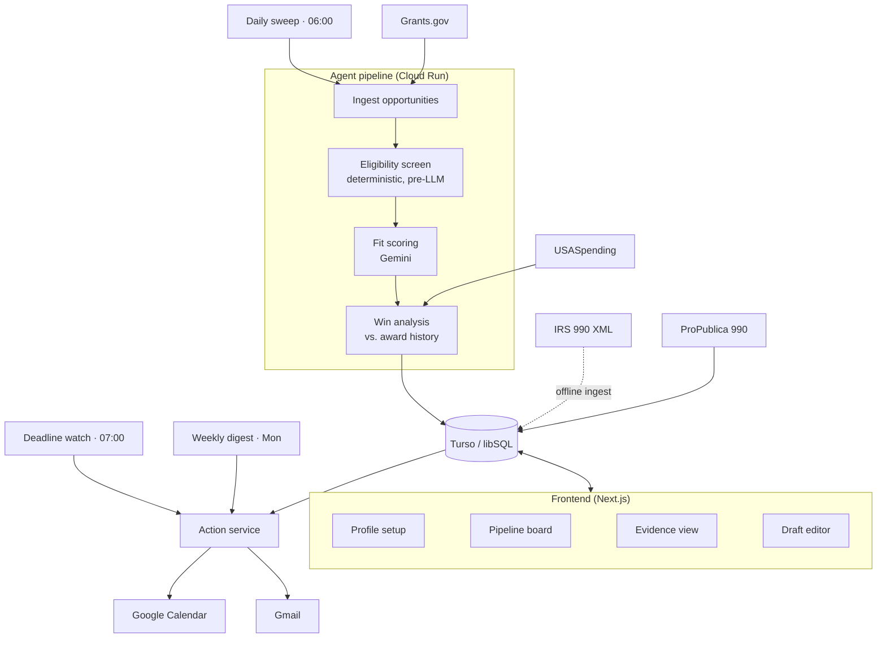

# Solution Design: "Merit"

### An autonomous Grants Manager for small nonprofits

**Author:** Nahom
**Date:** 6 August 2026
**Status:** For review and approval before implementation
**Assignment:** AI Automation Assignment, Full Stack AI Web Developer

---

## 1. Executive summary

**Merit is an AI agent that replaces the discovery, qualification, and deadline-management work of a nonprofit Grants Manager.**

A small nonprofit describes itself once: mission, programs, budget, legal status, geography, past awards. From then on the agent works on a schedule without being asked. It sweeps every federal funding opportunity in the United States daily, screens each one for hard eligibility, scores fit against the organisation's profile, and tells the organisation **whether it can realistically win** by analysing who has actually received money under that funding program historically. It backward-plans application milestones onto Google Calendar, drafts the narrative sections, and emails the Executive Director a weekly pipeline briefing.

The central claim is not discovery. Lists of grants are a commodity. It is **evidence-backed bid/no-bid advice**, the judgement a nonprofit normally pays a consultant $50-150/hour for, assembled entirely from free, authoritative government data.

Every data source named here was tested live before this document was written. Results are in Appendix A.

---

## 2. Role selection and rationale

### 2.1 The role

**Grants Manager / Development Officer at a small nonprofit:** annual budget under roughly $5M, with zero to one dedicated fundraising staff.

### 2.2 Why this role

I worked at **A2SV**, a nonprofit. Fundraising there was not a contained function. We had a hired grant finder, and *the entire team was still regularly pulled into chasing funding.* Engineers stopped engineering to help assemble applications.

That is the insight behind this project. The true cost of grant-seeking at a small nonprofit is not the fundraiser's salary. It is **the opportunity cost of everyone else**, spent disproportionately on opportunities the organisation was never positioned to win. Nobody had the time or the data to answer *"should we even apply to this?"* rigorously, so the default was to apply, and the default was expensive.

The automatable slice is exactly the slice that consumed the most collective time and required the least irreplaceable human judgement: reading a large volume of public announcements and deciding which few deserve the organisation's effort.

### 2.3 The economics of the role

The cost of this function is public and well documented:

| Benchmark | Price |
|---|---|
| Freelance grant writers | $50-150/hour |
| Ongoing retainer | $2,000-6,000/month |
| In-house grant writer (fully loaded) | ~$98,000/year |
| Instrumentl (category-leading software) | $179-899/month |

Small nonprofits pay these rates because the alternative, the diffuse and uncosted version described above, is worse.

Discovery and qualification are the components of that spend most amenable to automation. Both are *judgement applied to public text on a recurring schedule*: they reward exhaustive coverage and tirelessness, and they penalise forgetting. Merit reads every federal opportunity every day, which no human in this role does. The components that are not amenable, namely relationship-building, organisational strategy, and final narrative voice, are excluded by design and listed in §3.2.

### 2.4 Why an agent can beat a human here

An agent that only processes what the user hands it is a filing assistant, not a hire. Merit is built so the agent **knows things the organisation cannot know unaided**:

1. Every federal opportunity currently open, complete rather than a sample.
2. Who has historically won money under any given funding program, at what size, and how often.
3. Which private foundations have funded organisations of a similar type, size, and geography.

All three come from free public data. That asymmetry is what makes the agent worth hiring.

---

## 3. Role decomposition and prioritisation

### 3.1 Sub-functions

| # | Sub-function | Business impact | Automatability | Priority |
|---|---|---|---|---|
| 1 | **Bid/no-bid decision with award-history evidence** | **Very high** | **High** | **P0** |
| 2 | Opportunity discovery (federal) | High | Very high | P0 |
| 3 | Hard eligibility screening | High | Very high (deterministic) | P0 |
| 4 | Deadline & milestone management | High | Very high | P0 |
| 5 | Funder research (foundation giving patterns) | Very high | High | P1 |
| 6 | Narrative drafting (need statement, org capacity) | High | Medium (draft + human edit) | P1 |
| 7 | Pipeline reporting to ED / board | Medium | Very high | P1 |
| 8 | Budget construction | Medium | Low (assist only) | P2 |
| 9 | Post-award reporting & compliance | Medium | Medium | Out of scope |
| 10 | Relationship-building with program officers | Very high | **None** | **Stays human** |

### 3.2 What the agent explicitly does not do

Row 10 is stated deliberately. Program-officer relationships, board politics, and the organisational judgement of what to become are not automatable, and a design claiming otherwise would be dishonest about the role. Merit is scoped to make the human's limited time land on the *right* opportunities, not to replace the human.

### 3.3 Prioritisation logic

Effort concentrates where impact and automatability are both high (rows 1 to 5). Row 1 sits above discovery on purpose: discovery is a commodity that free alert services already provide badly, whereas the bid/no-bid decision is the expensive, high-leverage judgement, and the reason the tool is worth paying for.

---

## 4. Data sources

All five data sources are **free and require no API key or registration**. Google Calendar and Gmail use standard OAuth and need no billing account. Nothing in this system requires a credit card.

| Source | Access | Role in the system |
|---|---|---|
| Grants.gov (search + detail) | Live | Federal opportunity feed |
| USASpending.gov | Live | Historical award analysis: who won, how much, how often |
| IRS Form 990 e-file XML | **Bulk download, ingested offline** | Foundation giving records |
| ProPublica Nonprofit Explorer | Live | Foundation size and capacity |
| Google Calendar / Gmail | Live, write | Deadline milestones, digests |

Each source was called live and returned real data. Sample responses, record counts, and two findings that changed the design are in **Appendix A**.

---

## 5. Functional requirements

### F1. Organisation profile (structured input)

Provided once through a guided form: mission, program areas, NTEE code, EIN, 501(c)(3) status, annual budget, geography served, applicant type, past awards, and reusable boilerplate. This is the system's only manual input, and it is structured rather than free-text so that eligibility screening can be deterministic.

### F2. Opportunity ingestion

Scheduled sweep of Grants.gov for posted and forecasted opportunities, deduplicated, with full detail retrieved for anything new or changed.

### F3. Hard eligibility screening (deterministic, before any LLM call)

Rule-based pass/fail on applicant type, 501(c)(3) status, geography, and **entity country**. Failures are rejected before reaching the model: cheaper, faster, and not subject to hallucination. Every rejection stores a readable reason.

### F4. Fit scoring

Surviving opportunities are scored 0 to 100 against the profile by Gemini, returning schema-validated JSON: score, rationale, matched program areas, identified gaps.

### F5. Win-likelihood analysis

For each high-fit opportunity, the agent retrieves the historical award record for that same funding program and computes recipient size distribution, median and mean award, awards per cycle, and repeat-recipient concentration. Gemini turns this into a **bid / no-bid / investigate** recommendation with the statistics cited inline.

This is possible because Grants.gov and USASpending share a common program identifier, which lets an open opportunity be linked to every award ever made under it. *(Appendix A, item 3.)*

The practical effect: a $2M announcement that has gone to a major research university every year for six years is not a realistic opportunity for a $600k community organisation, however well the mission matches. The agent says so, and shows the award history behind the call so the user can audit it rather than trust it.

### F6. Foundation matching

Returns private foundations whose past grantees resemble the user's organisation on program area, geography, and size band, with typical grant size and comparable grantees.

Built from itemised grant records published in IRS Form 990 filings. *(Appendix A, item 4.)*

### F7. Deadline backward-planning (write action)

On acceptance into the pipeline, milestones are computed backward from the close date (LOI, first draft, board review, final review, submission) and written to **Google Calendar** with reminders.

### F8. Narrative drafting

Generates need statement, organisational capacity, and program description from the profile plus opportunity detail. Always a draft for human editing; never auto-submitted.

### F9. Pipeline management

Board view: `Discovered → Qualified → Drafting → Submitted → Awarded/Rejected`, with per-opportunity state and history.

### F10. Notifications and digests (write action)

High-fit alerts on discovery, a weekly pipeline briefing to the Executive Director, and at-risk warnings when a milestone slips.

---

## 6. Architecture



### 6.1 Stack

| Layer | Choice | Rationale |
|---|---|---|
| Frontend | Next.js 14 (App Router), TypeScript, Tailwind | Responsive; server components suit read-heavy dashboards |
| Backend | Next.js API routes + scheduled handlers on Cloud Run | Single deployable; Always Free tier |
| Scheduler | Cloud Scheduler | Always Free, exactly 3 jobs |
| Database | Turso / libSQL | Free without a card; foundation matching needs analytical SQL joins and aggregation, which a document store handles poorly |
| LLM | Gemini 2.5 Flash | Free tier; structured JSON output |
| Ingestion | Node script, run offline | IRS bulk XML → normalised grant records |
| Validation | Zod | Every LLM response is schema-validated before persistence |

*Firestore was considered as the GCP-native option and rejected: the foundation-matching queries are analytical, and SQL is the better fit. Turso is equally free and requires no card.*

### 6.2 Eligibility as a first-class concern

Motivated directly by the A2SV experience: entity country and applicant type are **hard filters evaluated before any LLM call**, and surfaced in the UI as an explicit reason when an otherwise-attractive opportunity is rejected. An organisation should never spend a day on an application it was structurally barred from.

---

## 7. Proactive automation: 3 scheduled jobs

| Job | Cadence | Behaviour |
|---|---|---|
| **Daily sweep** | 06:00 daily | Ingest new and changed opportunities → eligibility screen → fit score → win analysis. **Alerts only above threshold**; silence is a feature. |
| **Deadline watch** | 07:00 daily | Evaluate milestone health, escalate slipping items, email at-risk warnings. |
| **Weekly digest** | Monday 08:00 | ED briefing: what is live, what needs a decision this week, what is at risk, newly matched foundations. |

The agent initiates contact. The user is not required to log in for the system to produce value. That is the difference between a tool and an employee.

---

## 8. Actions the agent takes

| Action | Integration | Trigger | Human control |
|---|---|---|---|
| Create deadline milestones | Google Calendar | Opportunity accepted into pipeline | Reviewed before commit |
| Send high-fit alert | Gmail | Daily sweep, above threshold | Threshold configurable |
| Send weekly ED briefing | Gmail | Weekly schedule | Recipients configurable |
| Send at-risk warning | Gmail | Milestone slip detected | n/a |
| Draft narrative sections | Gemini | On qualification or request | **Always human-edited; never auto-submitted** |
| Record bid/no-bid | Internal | After win analysis | User can override with reason |

**Human-in-the-loop policy:** the agent may *inform*, *schedule*, and *draft* autonomously. It never submits an application and never contacts a funder. Overrides are captured with a reason, so the user's judgement is preserved rather than discarded.

---

## 9. UI and interaction model

Four surfaces, deliberately few:

1. **Profile setup.** Guided, structured, completed once.
2. **Pipeline board.** The daily working surface; opportunities as cards with fit score, deadline, and stage.
3. **Evidence view.** The centrepiece. Opens on an opportunity and shows *why*: the fit rationale, plus the award-history chart (recipient size distribution, median versus advertised ceiling, awards per cycle) supporting the bid/no-bid call.
4. **Draft editor.** Generated narrative side-by-side with the opportunity requirements.

Responsive throughout. The digest email is effectively a fifth surface, and often the only one a busy ED touches.

---

## 10. Data model (core tables)

```
organizations      profile, EIN, NTEE, budget, geography, applicant type, boilerplate
opportunities      id, title, agency, program number, open/close dates, synopsis, status
assessments        opportunity_id, fit_score, rationale, eligibility_result, bid_recommendation
award_history      program number, recipient, amount, fiscal_year, recipient_size_band
foundation_grants  funder_ein, recipient_name, state, purpose, amount, tax_year
foundations        ein, name, assets, total_grants_paid, grants_to_individuals
pipeline           opportunity_id, stage, milestones[], calendar_event_ids[]
runs               job, started_at, counts, errors
```

---

## 11. Free-tier compliance

- **No credit card required at any point.**
- GCP: Cloud Run and Cloud Scheduler (3 jobs) only. **No Cloud SQL.**
- Gemini free tier: the daily sweep screens deterministically before calling the model, keeping usage well inside the cap.
- Grants.gov, USASpending, IRS, ProPublica: free, unauthenticated, no quota registration.
- Google Calendar / Gmail: OAuth, no billing account.
- Turso: free tier, no card.

---

## 12. Scope

**v1, must work end to end**
F1 profile · F2 ingestion · F3 eligibility · F4 fit scoring · **F5 win analysis** · F7 calendar milestones · F8 drafting · F9 pipeline board · F10 digests · 3 scheduled jobs.

**v1, high value and contained risk**
F6 foundation matching, seeded from one IRS bundle ingested offline. Shipping it as a preloaded dataset means it cannot fail live.

**Deferred**
Multi-tenant auth hardening · additional IRS bundles · budget construction · post-award reporting · state and local grant sources.

---

## 13. Risks and mitigations

| Risk | Severity | Mitigation |
|---|---|---|
| LLM produces an unjustified bid/no-bid call | **High** | Recommendations must cite retrieved statistics; schema-validated output; the evidence view always shows the underlying data so reasoning can be audited |
| IRS ingestion overruns the schedule | Medium | Single bundle, ingested offline, shipped seeded, and deferrable without touching the spine |
| Gemini rate limits during demo | Medium | Deterministic pre-filter, batch scoring, cached assessments; results are persisted, so the demo reads stored data |
| Grants.gov outage or API change | Low | Responses cached in DB; UI degrades to stored data |
| 990 data lags 1 to 2 years | Low | Inherent to the source; positioned as *pattern* intelligence, with the federal feed supplying real-time |
| Foundation coverage incomplete | Low | Stated plainly in-product; federal coverage is complete and authoritative |

---

## 14. Success criteria

1. A profile can be created, and within one scheduled run the agent independently surfaces scored, screened opportunities.
2. For any opportunity, the system presents real award history and a defensible bid/no-bid recommendation.
3. Accepting an opportunity writes real milestones to a real Google Calendar.
4. A scheduled job sends a real digest email with no user interaction.
5. Foundation matching returns real funders from real IRS filings.
6. Frontend and backend are both substantive: the UI is a working surface, not a veneer.

---

## Appendix A: Data verification

Every source was called live on **6 August 2026**, before this design was committed to. No source requires an API key.

### 1. Grants.gov, opportunity search

Searching `"youth mental health"` returned **971 matching opportunities**. Each result carries the agency, status, open and close dates, and a federal program number:

```json
{ "hitCount": 971,
  "oppHits": [{
     "title": "…Empirically-Supported Practices for Youth Mental Health (R01…)",
     "agency": "National Institutes of Health",
     "openDate": "12/03/2024", "closeDate": "01/07/2027",
     "oppStatus": "posted", "cfdaList": ["93.242"] }] }
```

### 2. Grants.gov, opportunity detail

Requesting a single opportunity returns the full announcement: description, eligibility, award ceiling and floor, expected number of awards, and agency contacts. Enough to drive both fit scoring (F4) and drafting (F8).

### 3. USASpending, historical awards *(the mechanism behind F5)*

Note the `"cfdaList": ["93.242"]` above. That number is the federal program identifier, and USASpending accepts the **same number** as a search filter. Filtering on `93.242` returned real historical awards:

| Recipient | Award |
|---|---|
| University of California, Los Angeles | $973,507,476 |
| Johns Hopkins University | $276,059,720 |
| Harvard College | $213,206,023 |

Because the two systems share this identifier, any open opportunity can be linked to every award ever made under the same program, which is what turns "here is a grant" into "here is whether you can win it." This was the single most important assumption in the design, and it is confirmed on both sides.

*(The recipients above also illustrate the point in F5: this particular program funds large research universities.)*

### 4. IRS Form 990 e-file XML *(the mechanism behind F6)*

The IRS publishes every electronically filed Form 990 as structured XML. One monthly bundle (69 MB) was downloaded and parsed:

- **12,245** filings
- **786** foundations reporting itemised grants
- **11,670** individual grant records
- 344 grants in the largest single filing
- 53 records with foreign recipients and country codes

Each grant record identifies the recipient, where they are, what kind of organisation they are, what the money was for, and how much:

```xml
<GrantOrContributionPdDurYrGrp>
  <RecipientBusinessName>ST PATRICK CATHOLIC SCHOOL</RecipientBusinessName>
  <RecipientUSAddress><CityNm>CORPUS CHRISTI</CityNm><StateAbbreviationCd>TX</StateAbbreviationCd></RecipientUSAddress>
  <RecipientFoundationStatusTxt>PC</RecipientFoundationStatusTxt>
  <GrantOrContributionPurposeTxt>PROGRAM SUPPORT</GrantOrContributionPurposeTxt>
  <Amt>250</Amt>
</GrantOrContributionPdDurYrGrp>
```

That is enough to answer the operational question: *which foundations have funded organisations of this type, in this region, at this size, for this kind of program.* Commercial tools in the $179-899/month range are built on the same filings.

Purpose text is terse and inconsistent (`"PROGRAM SUPPORT"`, `"GENERAL SUPPORT"`), which is where Gemini earns its place: the facts come from the schema, the semantic matching comes from the model.

### 5. ProPublica Nonprofit Explorer

Returns ten years of financial history per foundation. For the Robert Wood Johnson Foundation, FY2023: **$551.2M** in grants paid against **$13.7B** in assets, flagged as a non-operating foundation that does grant to individuals. Good for sizing a funder and checking eligibility.

**Two findings that changed the design:** ProPublica returns financial *summaries* only, not itemised grantee lists, and its filing-PDF endpoint refuses programmatic requests (HTTP 403). Grantee-level data therefore comes from the IRS directly (item 4). Recorded here because the finding redirected the data layer.

**Not verified:** Google Calendar and Gmail are standard OAuth integrations requiring no billing account. They are assumed rather than tested, and are the only unverified dependencies in this design.
